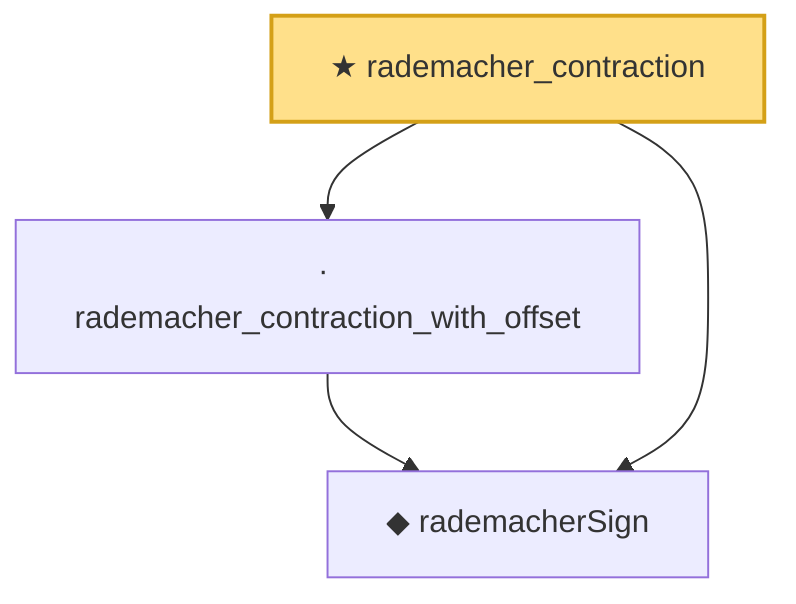

# Proof narrative — rademacher_contraction

Root: **rademacher_contraction** (theorem) `Statlib/StatFoundation/EmpiricalProcess/RademacherContraction.lean:772` · topic `StatFoundation`
Closure: 3 declarations across 2 files. Generated from `proof_graph.json` — no files were moved.

Reading order (foundations first, headline last):

  ◆ `rademacherSign` — def · `Statlib/StatFoundation/Vocabulary/EmpiricalProcess.lean:50`  _(also used by 5: finite_class_rademacher_complexity, rademacher_sign_sum_exp_eq_prod, rademacher_sign_mgf_bound, …)_
  · `rademacher_contraction_with_offset` — lemma · `Statlib/StatFoundation/EmpiricalProcess/RademacherContraction.lean:19`
★ `rademacher_contraction` — theorem · `Statlib/StatFoundation/EmpiricalProcess/RademacherContraction.lean:772` **← headline**

## Dependency diagram

