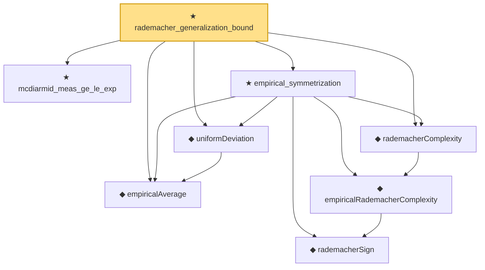

# Proof narrative — rademacher_generalization_bound

Root: **rademacher_generalization_bound** (theorem) `Statlib/StatFoundation/EmpiricalProcess/RademacherGeneralizationBound.lean:15` · topic `StatFoundation`
Closure: 8 declarations across 4 files. Generated from `proof_graph.json` — no files were moved.

Reading order (foundations first, headline last):

  ◆ `empiricalAverage` — noncomputable def · `Statlib/StatFoundation/Vocabulary/EmpiricalProcess.lean:35`  _(also used by 2: empirical_process_bounded_difference, uniform_deviation_finite_class)_
    ◆ `rademacherSign` — def · `Statlib/StatFoundation/Vocabulary/EmpiricalProcess.lean:50`  _(also used by 5: finite_class_rademacher_complexity, rademacher_contraction_with_offset, rademacher_contraction, …)_
    ◆ `empiricalRademacherComplexity` — noncomputable def · `Statlib/StatFoundation/Vocabulary/EmpiricalProcess.lean:56`  _(also used by 1: finite_class_rademacher_complexity)_
  ◆ `rademacherComplexity` — noncomputable def · `Statlib/StatFoundation/Vocabulary/EmpiricalProcess.lean:67`
  ★ `mcdiarmid_meas_ge_le_exp` — theorem · `Statlib/StatFoundation/Concentration/ExponentialType/mcdiarmid_meas_ge_le_exp.lean:9`  _(also used by 1: empirical_process_bounded_difference)_
  ◆ `uniformDeviation` — noncomputable def · `Statlib/StatFoundation/Vocabulary/EmpiricalProcess.lean:43`  _(also used by 2: empirical_process_bounded_difference, uniform_deviation_finite_class)_
  ★ `empirical_symmetrization` — theorem · `Statlib/StatFoundation/EmpiricalProcess/Symmetrization.lean:25`
★ `rademacher_generalization_bound` — theorem · `Statlib/StatFoundation/EmpiricalProcess/RademacherGeneralizationBound.lean:15` **← headline**

## Dependency diagram

