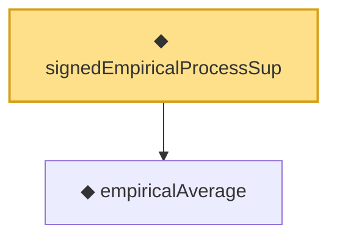

# Proof narrative — signedEmpiricalProcessSup

Root: **signedEmpiricalProcessSup** (noncomputable def) `Statlib/StatFoundation/Vocabulary/EmpiricalProcess.lean:84` · topic `StatFoundation`
Closure: 2 declarations across 1 files. Generated from `proof_graph.json` — no files were moved.

Reading order (foundations first, headline last):

  ◆ `empiricalAverage` — noncomputable def · `Statlib/StatFoundation/Vocabulary/EmpiricalProcess.lean:35`  _(also used by 6: empirical_process_bounded_difference, rademacher_generalization_bound, finite_class_one_sided_deviation_tail_from_rademacher_complexity, …)_
◆ `signedEmpiricalProcessSup` — noncomputable def · `Statlib/StatFoundation/Vocabulary/EmpiricalProcess.lean:84` **← headline**

## Dependency diagram

