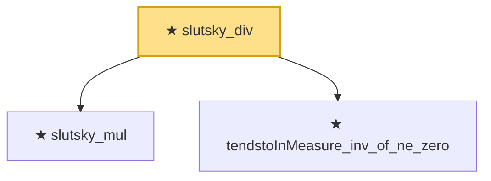

# Proof narrative — slutsky_div

Root: **slutsky_div** (theorem) `Statlib/StatFoundation/Convergence/AnalysisTools/MappingTheorems.lean:108` · topic `StatFoundation`
Closure: 3 declarations across 1 files. Generated from `proof_graph.json` — no files were moved.

Reading order (foundations first, headline last):

  ★ `slutsky_mul` — theorem · `Statlib/StatFoundation/Convergence/AnalysisTools/MappingTheorems.lean:40`
  ★ `tendstoInMeasure_inv_of_ne_zero` — theorem · `Statlib/StatFoundation/Convergence/AnalysisTools/MappingTheorems.lean:61`
★ `slutsky_div` — theorem · `Statlib/StatFoundation/Convergence/AnalysisTools/MappingTheorems.lean:108` **← headline**

## Dependency diagram

