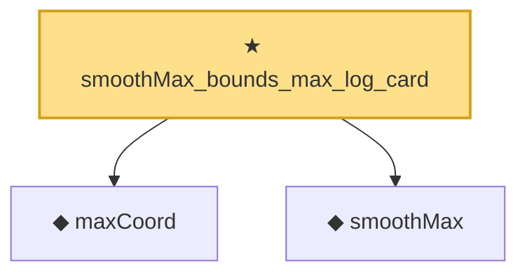

# Proof narrative — smoothMax_bounds_max_log_card

Root: **smoothMax_bounds_max_log_card** (theorem) `Statlib/StatFoundation/Convergence/AnalysisTools/SmoothMax.lean:75` · topic `StatFoundation`
Closure: 3 declarations across 2 files. Generated from `proof_graph.json` — no files were moved.

Reading order (foundations first, headline last):

  ◆ `maxCoord` — noncomputable def · `Statlib/StatFoundation/Vocabulary/MaxType.lean:34`  _(also used by 12: maxCoord_measurable, maxCoord_lipschitz, maxCoord_lipschitz_ineq, …)_
  ◆ `smoothMax` — noncomputable def · `Statlib/StatFoundation/Convergence/AnalysisTools/SmoothMax.lean:37`  _(also used by 5: one_step_smooth_lindeberg_bound_bounded, smoothMax_def_measurable_continuous, smoothMax_gradient_eq_softmax, …)_
★ `smoothMax_bounds_max_log_card` — theorem · `Statlib/StatFoundation/Convergence/AnalysisTools/SmoothMax.lean:75` **← headline**

## Dependency diagram

