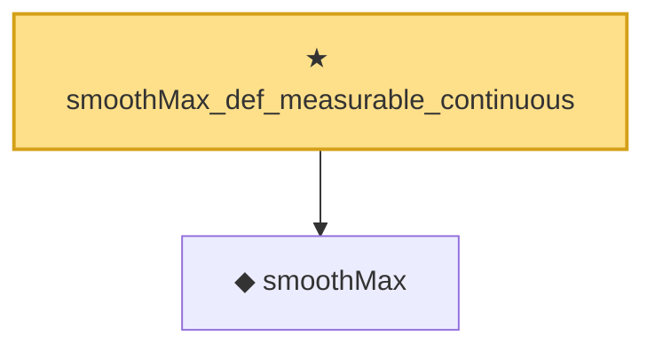

# Proof narrative — smoothMax_def_measurable_continuous

Root: **smoothMax_def_measurable_continuous** (theorem) `Statlib/StatFoundation/Convergence/AnalysisTools/SmoothMax.lean:46` · topic `StatFoundation`
Closure: 2 declarations across 1 files. Generated from `proof_graph.json` — no files were moved.

Reading order (foundations first, headline last):

  ◆ `smoothMax` — noncomputable def · `Statlib/StatFoundation/Convergence/AnalysisTools/SmoothMax.lean:37`  _(also used by 5: one_step_smooth_lindeberg_bound_bounded, smoothMax_bounds_max_log_card, smoothMax_gradient_eq_softmax, …)_
★ `smoothMax_def_measurable_continuous` — theorem · `Statlib/StatFoundation/Convergence/AnalysisTools/SmoothMax.lean:46` **← headline**

## Dependency diagram

