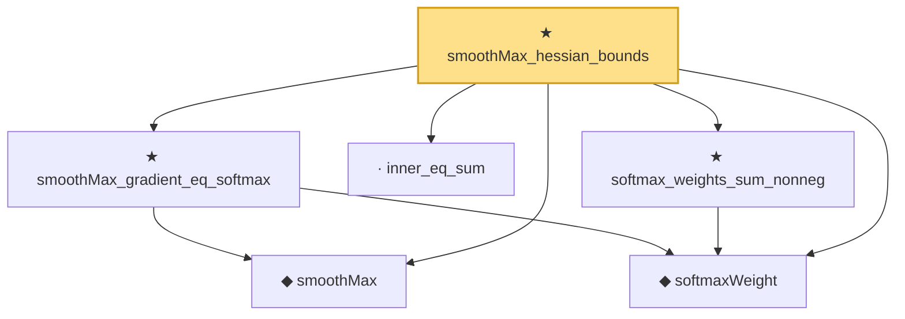

# Proof narrative — smoothMax_hessian_bounds

Root: **smoothMax_hessian_bounds** (theorem) `Statlib/StatFoundation/Convergence/AnalysisTools/SmoothMax.lean:290` · topic `StatFoundation`
Closure: 6 declarations across 2 files. Generated from `proof_graph.json` — no files were moved.

Reading order (foundations first, headline last):

  ◆ `smoothMax` — noncomputable def · `Statlib/StatFoundation/Convergence/AnalysisTools/SmoothMax.lean:37`  _(also used by 4: one_step_smooth_lindeberg_bound_bounded, smoothMax_def_measurable_continuous, smoothMax_bounds_max_log_card, …)_
  ◆ `softmaxWeight` — noncomputable def · `Statlib/StatFoundation/Convergence/AnalysisTools/SmoothMax.lean:42`  _(also used by 2: one_step_smooth_lindeberg_bound_bounded, smoothMax_third_derivative_bounds)_
  ★ `smoothMax_gradient_eq_softmax` — theorem · `Statlib/StatFoundation/Convergence/AnalysisTools/SmoothMax.lean:173`  _(also used by 2: one_step_smooth_lindeberg_bound_bounded, smoothMax_third_derivative_bounds)_
  · `inner_eq_sum` — lemma · `Statlib/HighDim/Vocabulary/Norms.lean:100`  _(also used by 20: decoupledOffDiagQuadForm_eq_inner_coeff, offDiagCoeffVec_apply_eq_inner_row_zeroDiag, subgaussian_vector_coord, …)_
  ★ `softmax_weights_sum_nonneg` — theorem · `Statlib/StatFoundation/Convergence/AnalysisTools/SmoothMax.lean:146`  _(also used by 1: smoothMax_third_derivative_bounds)_
★ `smoothMax_hessian_bounds` — theorem · `Statlib/StatFoundation/Convergence/AnalysisTools/SmoothMax.lean:290` **← headline**

## Dependency diagram

