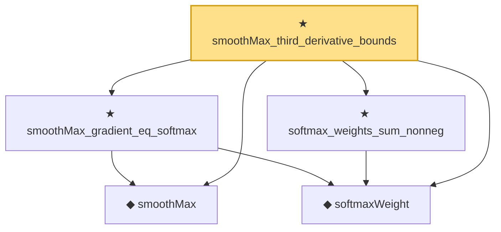

# Proof narrative — smoothMax_third_derivative_bounds

Root: **smoothMax_third_derivative_bounds** (theorem) `Statlib/StatFoundation/Convergence/AnalysisTools/SmoothMax.lean:599` · topic `StatFoundation`
Closure: 5 declarations across 1 files. Generated from `proof_graph.json` — no files were moved.

Reading order (foundations first, headline last):

  ◆ `smoothMax` — noncomputable def · `Statlib/StatFoundation/Convergence/AnalysisTools/SmoothMax.lean:37`  _(also used by 4: one_step_smooth_lindeberg_bound_bounded, smoothMax_def_measurable_continuous, smoothMax_bounds_max_log_card, …)_
  ◆ `softmaxWeight` — noncomputable def · `Statlib/StatFoundation/Convergence/AnalysisTools/SmoothMax.lean:42`  _(also used by 2: one_step_smooth_lindeberg_bound_bounded, smoothMax_hessian_bounds)_
  ★ `smoothMax_gradient_eq_softmax` — theorem · `Statlib/StatFoundation/Convergence/AnalysisTools/SmoothMax.lean:173`  _(also used by 2: one_step_smooth_lindeberg_bound_bounded, smoothMax_hessian_bounds)_
  ★ `softmax_weights_sum_nonneg` — theorem · `Statlib/StatFoundation/Convergence/AnalysisTools/SmoothMax.lean:146`  _(also used by 1: smoothMax_hessian_bounds)_
★ `smoothMax_third_derivative_bounds` — theorem · `Statlib/StatFoundation/Convergence/AnalysisTools/SmoothMax.lean:599` **← headline**

## Dependency diagram

