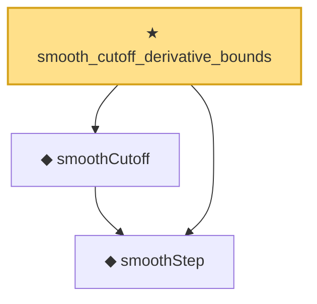

# Proof narrative — smooth_cutoff_derivative_bounds

Root: **smooth_cutoff_derivative_bounds** (theorem) `Statlib/StatFoundation/Convergence/AnalysisTools/SmoothCutoff.lean:111` · topic `StatFoundation`
Closure: 3 declarations across 1 files. Generated from `proof_graph.json` — no files were moved.

Reading order (foundations first, headline last):

  ◆ `smoothStep` — noncomputable def · `Statlib/StatFoundation/Convergence/AnalysisTools/SmoothCutoff.lean:32`  _(also used by 1: smooth_cutoff_indicator_sandwich)_
  ◆ `smoothCutoff` — noncomputable def · `Statlib/StatFoundation/Convergence/AnalysisTools/SmoothCutoff.lean:37`  _(also used by 1: smooth_cutoff_indicator_sandwich)_
★ `smooth_cutoff_derivative_bounds` — theorem · `Statlib/StatFoundation/Convergence/AnalysisTools/SmoothCutoff.lean:111` **← headline**

## Dependency diagram

