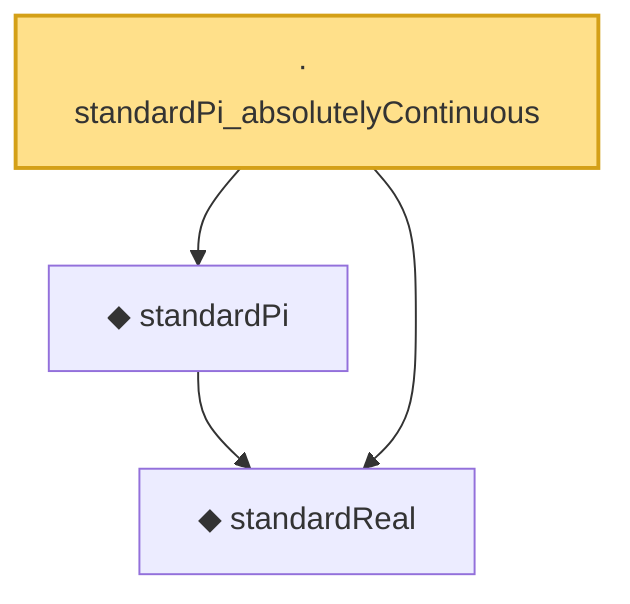

# Proof narrative — standardPi_absolutelyContinuous

Root: **standardPi_absolutelyContinuous** (lemma) `Statlib/StatFoundation/RandomVariable/Gaussian/Standard.lean:40` · topic `StatFoundation`
Closure: 3 declarations across 1 files. Generated from `proof_graph.json` — no files were moved.

Reading order (foundations first, headline last):

  ◆ `standardReal` — abbrev · `Statlib/StatFoundation/RandomVariable/Gaussian/Standard.lean:31`  _(also used by 47: memLp_aeval_intPolynomial_standard, integrable_aeval_intPolynomial_standard, memLp_hermite_eval_mul, …)_
  ◆ `standardPi` — def · `Statlib/StatFoundation/RandomVariable/Gaussian/Standard.lean:34`  _(also used by 7: integrable_id_standardPi, integrable_lipschitz_standardPi, integrable_exp_norm_standardPi_of_nonneg, …)_
· `standardPi_absolutelyContinuous` — lemma · `Statlib/StatFoundation/RandomVariable/Gaussian/Standard.lean:40` **← headline**

## Dependency diagram

