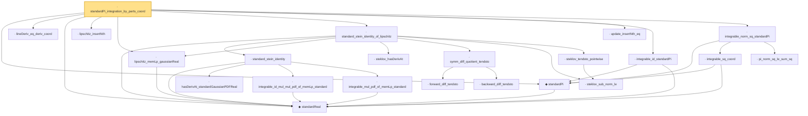

# Proof narrative — standardPi_integration_by_parts_coord

Root: **standardPi_integration_by_parts_coord** (lemma) `Statlib/StatFoundation/RandomVariable/Gaussian/Stein.lean:428` · topic `StatFoundation`
Closure: 22 declarations across 2 files. Generated from `proof_graph.json` — no files were moved.

Reading order (foundations first, headline last):

  ◆ `standardReal` — abbrev · `Statlib/StatFoundation/RandomVariable/Gaussian/Standard.lean:31`  _(also used by 26: memLp_aeval_intPolynomial_standard, integrable_aeval_intPolynomial_standard, memLp_hermite_eval_mul, …)_
  ◆ `standardPi` — def · `Statlib/StatFoundation/RandomVariable/Gaussian/Standard.lean:34`  _(also used by 4: standardPi_absolutelyContinuous, integrable_lipschitz_standardPi, integrable_exp_norm_standardPi_of_nonneg, …)_
  · `lineDeriv_eq_deriv_coord` — private lemma · `Statlib/StatFoundation/RandomVariable/Gaussian/Stein.lean:354`
  · `lipschitz_insertNth` — private lemma · `Statlib/StatFoundation/RandomVariable/Gaussian/Stein.lean:378`
  · `lipschitz_memLp_gaussianReal` — private lemma · `Statlib/StatFoundation/RandomVariable/Gaussian/Stein.lean:86`
      · `hasDerivAt_standardGaussianPDFReal` — lemma · `Statlib/StatFoundation/RandomVariable/Gaussian/Standard.lean:178`  _(also used by 1: hasDerivAt_hermite_eval_mul_gaussianPDF)_
      · `integrable_id_mul_mul_pdf_of_memLp_standard` — lemma · `Statlib/StatFoundation/RandomVariable/Gaussian/Standard.lean:96`
      · `integrable_mul_pdf_of_memLp_standard` — lemma · `Statlib/StatFoundation/RandomVariable/Gaussian/Standard.lean:84`
    · `standard_stein_identity` — lemma · `Statlib/StatFoundation/RandomVariable/Gaussian/Stein.lean:25`  _(also used by 2: integral_hermite_eval_eq_zero, integral_hermite_eval_mul_succ)_
    · `steklov_hasDerivAt` — private lemma · `Statlib/StatFoundation/RandomVariable/Gaussian/Stein.lean:63`
      · `forward_diff_tendsto` — private lemma · `Statlib/StatFoundation/RandomVariable/Gaussian/Stein.lean:106`
      · `backward_diff_tendsto` — private lemma · `Statlib/StatFoundation/RandomVariable/Gaussian/Stein.lean:116`
    · `symm_diff_quotient_tendsto` — private lemma · `Statlib/StatFoundation/RandomVariable/Gaussian/Stein.lean:128`
    · `steklov_sub_norm_le` — private lemma · `Statlib/StatFoundation/RandomVariable/Gaussian/Stein.lean:139`
    · `steklov_tendsto_pointwise` — private lemma · `Statlib/StatFoundation/RandomVariable/Gaussian/Stein.lean:174`
  · `standard_stein_identity_of_lipschitz` — lemma · `Statlib/StatFoundation/RandomVariable/Gaussian/Stein.lean:201`
  · `update_insertNth_eq` — private lemma · `Statlib/StatFoundation/RandomVariable/Gaussian/Stein.lean:369`
  · `integrable_id_standardPi` — lemma · `Statlib/StatFoundation/RandomVariable/Gaussian/Standard.lean:197`  _(also used by 1: integrable_lipschitz_standardPi)_
    · `integrable_sq_coord` — private lemma · `Statlib/StatFoundation/RandomVariable/Gaussian/Stein.lean:392`
    · `pi_norm_sq_le_sum_sq` — private lemma · `Statlib/StatFoundation/RandomVariable/Gaussian/Stein.lean:402`
  · `integrable_norm_sq_standardPi` — private lemma · `Statlib/StatFoundation/RandomVariable/Gaussian/Stein.lean:414`
· `standardPi_integration_by_parts_coord` — lemma · `Statlib/StatFoundation/RandomVariable/Gaussian/Stein.lean:428` **← headline**

## Dependency diagram

