# Proof narrative — standardPi_logSobolev_smooth_finiteFisher

Root: **standardPi_logSobolev_smooth_finiteFisher** (theorem) `Statlib/StatFoundation/RandomVariable/Gaussian/LogSobolev.lean:11830` · topic `StatFoundation`
Closure: 59 declarations across 5 files. Generated from `proof_graph.json` — no files were moved.

Reading order (foundations first, headline last):

  ◆ `standardReal` — abbrev · `Statlib/StatFoundation/RandomVariable/Gaussian/Standard.lean:31`  _(also used by 41: single_square_law, wald_statistic_asymptotic_chisq1, score_statistic_asymptotic_chisq1, …)_
  ◆ `standardPi` — def · `Statlib/StatFoundation/RandomVariable/Gaussian/Standard.lean:34`  _(also used by 20: one_sample_t_test, standardPi_sFinite, standardPi_integral_finCons, …)_
  · `abs_le_of_deriv_bound` — lemma · `Statlib/StatFoundation/RandomVariable/Gaussian/LogSobolev.lean:28`
  · `integrable_of_contDiff_deriv_bounded_standardReal` — lemma · `Statlib/StatFoundation/RandomVariable/Gaussian/LogSobolev.lean:50`
  ◆ `standardReal_ou_mehler` — def · `Statlib/StatFoundation/RandomVariable/Gaussian/LogSobolev.lean:1301`  _(also used by 1: standardPi_logSobolev_smooth_finiteFisher_coord)_
          · `integrable_exp_abs_gaussianReal` — lemma · `Statlib/StatFoundation/RandomVariable/Gaussian/LogSobolev.lean:659`
          · `integrable_linear_mul_exp_abs_gaussianReal` — lemma · `Statlib/StatFoundation/RandomVariable/Gaussian/LogSobolev.lean:688`
            · `integrable_linear_mul_exp_abs_mul_gaussianPDFReal` — lemma · `Statlib/StatFoundation/RandomVariable/Gaussian/LogSobolev.lean:768`
            · `weighted_gaussian_integrableExpSet_id_eq_univ` — lemma · `Statlib/StatFoundation/RandomVariable/Gaussian/LogSobolev.lean:940`
  · `gaussian_kernel_eq_gaussianPDFReal` — lemma · `Statlib/StatFoundation/RandomVariable/Gaussian/LogSobolev.lean:894`  _(also used by 1: standardPi_logSobolev_smooth_finiteFisher_coord)_
            · `gaussian_kernel_exp_mul_zero_pdf` — lemma · `Statlib/StatFoundation/RandomVariable/Gaussian/LogSobolev.lean:919`
          · `gaussian_convolution_nonneg_linearGrowth_contDiff_top` — lemma · `Statlib/StatFoundation/RandomVariable/Gaussian/LogSobolev.lean:1077`
          · `gaussian_convolution_linearGrowth_integrable` — lemma · `Statlib/StatFoundation/RandomVariable/Gaussian/LogSobolev.lean:1004`
  · `gaussian_convolution_linearGrowth_contDiff_top_of_bound` — lemma · `Statlib/StatFoundation/RandomVariable/Gaussian/LogSobolev.lean:1155`  _(also used by 1: standardPi_logSobolev_smooth_finiteFisher_coord)_
      ★ `standardReal_mehler_apply_contDiff` — theorem · `Statlib/StatFoundation/RandomVariable/Gaussian/LogSobolev.lean:1831`  _(also used by 1: standardReal_ou_mehler_basic)_
      · `standardReal_mehler_integrand_integrable` — lemma · `Statlib/StatFoundation/RandomVariable/Gaussian/LogSobolev.lean:1578`  _(also used by 1: standardReal_mehler_apply_continuous)_
      · `standardReal_mehler_apply_pos` — lemma · `Statlib/StatFoundation/RandomVariable/Gaussian/LogSobolev.lean:1661`  _(also used by 1: standardReal_ou_mehler_basic)_
  · `standardReal_mehler_apply_zero` — lemma · `Statlib/StatFoundation/RandomVariable/Gaussian/LogSobolev.lean:1652`  _(also used by 2: standardReal_ou_mehler_basic, standardPi_logSobolev_smooth_finiteFisher_coord)_
            · `memLp_pow_id_gaussianReal_aux` — private lemma · `Statlib/StatFoundation/RandomVariable/Gaussian/Standard.lean:114`
  · `memLp_pow_id_gaussianReal` — lemma · `Statlib/StatFoundation/RandomVariable/Gaussian/Standard.lean:139`
      ★ `standardReal_ou_mehler_log_growth_local_pos` — theorem · `Statlib/StatFoundation/RandomVariable/Gaussian/LogSobolev.lean:2755`
  · `standardReal_integrable_mul_log_of_pos_contDiff_deriv_bounded` — lemma · `Statlib/StatFoundation/RandomVariable/Gaussian/LogSobolev.lean:80`  _(also used by 1: standardPi_logSobolev_smooth_finiteFisher_coord)_
      · `memLp_polynomial_standard` — lemma · `Statlib/StatFoundation/RandomVariable/Gaussian/Standard.lean:144`  _(also used by 2: standardPi_logSobolev_smooth_finiteFisher_coord, integrable_polynomial_mul_pdf_standard)_
          · `memLp_aeval_intPolynomial_standard` — lemma · `Statlib/StatFoundation/RandomVariable/Gaussian/Hermite.lean:43`  _(also used by 4: memLp_hermite_eval_mul, memLp_deriv_hermite_eval_mul, integral_hermite_eval_eq_zero, …)_
        · `integrable_aeval_intPolynomial_standard` — lemma · `Statlib/StatFoundation/RandomVariable/Gaussian/Hermite.lean:52`  _(also used by 2: integral_hermite_eval_eq_zero, integral_hermite_eval_mul_succ)_
  · `integrable_linear_mul_exp_abs_standard` — lemma · `Statlib/StatFoundation/RandomVariable/Gaussian/LogSobolev.lean:762`
      ★ `standardReal_ou_mehler_time_hasDerivAt_pos` — theorem · `Statlib/StatFoundation/RandomVariable/Gaussian/LogSobolev.lean:3515`
      ★ `standardReal_ou_mehler_entropy_derivative_pos` — theorem · `Statlib/StatFoundation/RandomVariable/Gaussian/LogSobolev.lean:4353`
        · `hasDerivAt_standardGaussianPDFReal` — lemma · `Statlib/StatFoundation/RandomVariable/Gaussian/Standard.lean:178`  _(also used by 1: hasDerivAt_hermite_eval_mul_gaussianPDF)_
            · `integrable_id_mul_mul_pdf_of_memLp_standard` — lemma · `Statlib/StatFoundation/RandomVariable/Gaussian/Standard.lean:96`
            · `integrable_mul_pdf_of_memLp_standard` — lemma · `Statlib/StatFoundation/RandomVariable/Gaussian/Standard.lean:84`
          · `standard_stein_identity` — lemma · `Statlib/StatFoundation/RandomVariable/Gaussian/Stein.lean:25`  _(also used by 3: integral_hermite_eval_eq_zero, integral_hermite_eval_mul_succ, standard_stein_identity_of_lipschitz)_
          · `integrable_mul_polynomial_of_memLp_standard` — lemma · `Statlib/StatFoundation/RandomVariable/Gaussian/Hermite.lean:302`  _(also used by 1: integral_polynomial_mul_eq_zero_of_moments)_
        · `standardReal_integrationByParts_smooth_bddDeriv` — lemma · `Statlib/StatFoundation/RandomVariable/Gaussian/LogSobolev.lean:202`  _(also used by 1: gaussianMollifier_fderiv_tendsto_ae_of_lipschitz)_
      ★ `integrable_id` — theorem · `Statlib/StatFoundation/RandomVariable/Gaussian/HilbertSpace.lean:253`  _(also used by 1: standardPi_logSobolev_smooth_finiteFisher_coord)_
      ★ `standardReal_ou_mehler_generator_pos` — theorem · `Statlib/StatFoundation/RandomVariable/Gaussian/LogSobolev.lean:5360`
        · `integrable_quadratic_mul_exp_abs_gaussianReal` — lemma · `Statlib/StatFoundation/RandomVariable/Gaussian/LogSobolev.lean:784`  _(also used by 2: integrable_quadratic_mul_exp_abs_mul_gaussianPDFReal, gaussianMollifier_fderiv_tendsto_ae_of_lipschitz)_
          ★ `standardReal_ou_mehler_time_deriv_linear_bound_pos` — theorem · `Statlib/StatFoundation/RandomVariable/Gaussian/LogSobolev.lean:3787`
        ★ `standardReal_ou_mehler_generator_memLp_two_pos` — theorem · `Statlib/StatFoundation/RandomVariable/Gaussian/LogSobolev.lean:6343`
        ★ `standardReal_ou_mehler_log_growth_pos` — theorem · `Statlib/StatFoundation/RandomVariable/Gaussian/LogSobolev.lean:2122`
    ★ `standardReal_ou_mehler_fisher_integrable_pos` — theorem · `Statlib/StatFoundation/RandomVariable/Gaussian/LogSobolev.lean:7221`
      ★ `standardReal_ou_mehler_entropy_ibp_pos` — theorem · `Statlib/StatFoundation/RandomVariable/Gaussian/LogSobolev.lean:7975`
      ★ `standardReal_ou_mehler_spatial_deriv_pos` — theorem · `Statlib/StatFoundation/RandomVariable/Gaussian/LogSobolev.lean:6473`
  ★ `standardReal_integrable_affine_contract_of_integrable` — theorem · `Statlib/StatFoundation/RandomVariable/Gaussian/LogSobolev.lean:6752`  _(also used by 1: standardPi_logSobolev_smooth_finiteFisher_coord)_
    ★ `standardReal_ou_mehler_kernel_fisher_integrable_of_fisher_integrable` — theorem · `Statlib/StatFoundation/RandomVariable/Gaussian/LogSobolev.lean:7173`
        ★ `standardReal_ou_mehler_fisher_pointwise_pos_of_kernel_integrable` — theorem · `Statlib/StatFoundation/RandomVariable/Gaussian/LogSobolev.lean:6968`
  ★ `standardReal_ou_mehler_integral_invariant` — theorem · `Statlib/StatFoundation/RandomVariable/Gaussian/LogSobolev.lean:6584`  _(also used by 1: standardPi_logSobolev_smooth_finiteFisher_coord)_
      ★ `standardReal_ou_mehler_fisher_decay_pos_of_fisher_integrable` — theorem · `Statlib/StatFoundation/RandomVariable/Gaussian/LogSobolev.lean:8372`
      ★ `standardReal_ou_mehler_entropy_integrand_hasDerivAt_pos` — theorem · `Statlib/StatFoundation/RandomVariable/Gaussian/LogSobolev.lean:3747`
  · `integrable_exp_abs_standard` — lemma · `Statlib/StatFoundation/RandomVariable/Gaussian/Standard.lean:239`  _(also used by 3: integral_cexp_mul_eq_zero_of_moments, euclideanStandardGaussian_integrable_exp_of_lipschitz, standardPi_logSobolev_smooth_finiteFisher_coord)_
    ★ `standardReal_logSobolev_smooth_normalized_finiteFisher` — theorem · `Statlib/StatFoundation/RandomVariable/Gaussian/LogSobolev.lean:8636`
  ★ `standardReal_logSobolev_smooth_finiteFisher` — theorem · `Statlib/StatFoundation/RandomVariable/Gaussian/LogSobolev.lean:10962`
    · `integrable_id_standardPi` — lemma · `Statlib/StatFoundation/RandomVariable/Gaussian/Standard.lean:197`  _(also used by 2: standardPi_logSobolev_smooth_finiteFisher_coord, standardPi_integration_by_parts_coord)_
  · `integrable_lipschitz_standardPi` — lemma · `Statlib/StatFoundation/RandomVariable/Gaussian/Standard.lean:211`  _(also used by 1: standardPi_logSobolev_smooth_finiteFisher_coord)_
    · `pi_norm_le_sum_abs` — lemma · `Statlib/StatFoundation/RandomVariable/Gaussian/Standard.lean:272`  _(also used by 1: standardPi_logSobolev_smooth_finiteFisher_coord)_
  · `integrable_exp_norm_standardPi_of_nonneg` — lemma · `Statlib/StatFoundation/RandomVariable/Gaussian/Standard.lean:281`  _(also used by 4: standardPi_logSobolev_smooth_finiteFisher_coord, standardGaussian_logSobolev_exp_smooth, standardGaussian_logSobolev_exp_lipschitz_of_smooth_approximation, …)_
    · `standardReal_ou_mehler_semigroup` — lemma · `Statlib/StatFoundation/RandomVariable/Gaussian/LogSobolev.lean:1308`
  · `standardReal_mehler_entropy_bound_of_C1` — lemma · `Statlib/StatFoundation/RandomVariable/Gaussian/LogSobolev.lean:11159`  _(also used by 1: standardPi_logSobolev_smooth_finiteFisher_coord)_
★ `standardPi_logSobolev_smooth_finiteFisher` — theorem · `Statlib/StatFoundation/RandomVariable/Gaussian/LogSobolev.lean:11830` **← headline**

## Dependency diagram

```mermaid
flowchart TD
  n0["◆ standardReal"]
  n1["◆ standardPi"]
  n2["· abs_le_of_deriv_bound"]
  n3["· integrable_of_contDiff_deriv_bounded_standardReal"]
  n4["◆ standardReal_ou_mehler"]
  n5["· integrable_exp_abs_gaussianReal"]
  n6["· integrable_linear_mul_exp_abs_gaussianReal"]
  n7["· integrable_linear_mul_exp_abs_mul_gaussianPDFReal"]
  n8["· weighted_gaussian_integrableExpSet_id_eq_univ"]
  n9["· gaussian_kernel_eq_gaussianPDFReal"]
  n10["· gaussian_kernel_exp_mul_zero_pdf"]
  n11["· gaussian_convolution_nonneg_linearGrowth_contDiff_top"]
  n12["· gaussian_convolution_linearGrowth_integrable"]
  n13["· gaussian_convolution_linearGrowth_contDiff_top_of_bound"]
  n14["★ standardReal_mehler_apply_contDiff"]
  n15["· standardReal_mehler_integrand_integrable"]
  n16["· standardReal_mehler_apply_pos"]
  n17["· standardReal_mehler_apply_zero"]
  n18["· memLp_pow_id_gaussianReal_aux"]
  n19["· memLp_pow_id_gaussianReal"]
  n20["★ standardReal_ou_mehler_log_growth_local_pos"]
  n21["· standardReal_integrable_mul_log_of_pos_contDiff_deriv_bounded"]
  n22["· memLp_polynomial_standard"]
  n23["· memLp_aeval_intPolynomial_standard"]
  n24["· integrable_aeval_intPolynomial_standard"]
  n25["· integrable_linear_mul_exp_abs_standard"]
  n26["★ standardReal_ou_mehler_time_hasDerivAt_pos"]
  n27["★ standardReal_ou_mehler_entropy_derivative_pos"]
  n28["· hasDerivAt_standardGaussianPDFReal"]
  n29["· integrable_id_mul_mul_pdf_of_memLp_standard"]
  n30["· integrable_mul_pdf_of_memLp_standard"]
  n31["· standard_stein_identity"]
  n32["· integrable_mul_polynomial_of_memLp_standard"]
  n33["· standardReal_integrationByParts_smooth_bddDeriv"]
  n34["★ integrable_id"]
  n35["★ standardReal_ou_mehler_generator_pos"]
  n36["· integrable_quadratic_mul_exp_abs_gaussianReal"]
  n37["★ standardReal_ou_mehler_time_deriv_linear_bound_pos"]
  n38["★ standardReal_ou_mehler_generator_memLp_two_pos"]
  n39["★ standardReal_ou_mehler_log_growth_pos"]
  n40["★ standardReal_ou_mehler_fisher_integrable_pos"]
  n41["★ standardReal_ou_mehler_entropy_ibp_pos"]
  n42["★ standardReal_ou_mehler_spatial_deriv_pos"]
  n43["★ standardReal_integrable_affine_contract_of_integrable"]
  n44["★ standardReal_ou_mehler_kernel_fisher_integrable_of_fisher_integrable"]
  n45["★ standardReal_ou_mehler_fisher_pointwise_pos_of_kernel_integrable"]
  n46["★ standardReal_ou_mehler_integral_invariant"]
  n47["★ standardReal_ou_mehler_fisher_decay_pos_of_fisher_integrable"]
  n48["★ standardReal_ou_mehler_entropy_integrand_hasDerivAt_pos"]
  n49["· integrable_exp_abs_standard"]
  n50["★ standardReal_logSobolev_smooth_normalized_finiteFisher"]
  n51["★ standardReal_logSobolev_smooth_finiteFisher"]
  n52["· integrable_id_standardPi"]
  n53["· integrable_lipschitz_standardPi"]
  n54["· pi_norm_le_sum_abs"]
  n55["· integrable_exp_norm_standardPi_of_nonneg"]
  n56["· standardReal_ou_mehler_semigroup"]
  n57["· standardReal_mehler_entropy_bound_of_C1"]
  n58["★ standardPi_logSobolev_smooth_finiteFisher"]
  n1 --> n0
  n3 --> n0
  n3 --> n2
  n4 --> n0
  n6 --> n5
  n7 --> n6
  n8 --> n7
  n10 --> n9
  n11 --> n8
  n11 --> n10
  n12 --> n7
  n12 --> n9
  n13 --> n11
  n13 --> n12
  n14 --> n0
  n14 --> n2
  n14 --> n13
  n15 --> n0
  n15 --> n3
  n16 --> n0
  n16 --> n15
  n17 --> n0
  n19 --> n18
  n20 --> n4
  n20 --> n16
  n20 --> n2
  n20 --> n0
  n20 --> n15
  n20 --> n19
  n21 --> n0
  n21 --> n19
  n22 --> n0
  n22 --> n19
  n23 --> n0
  n23 --> n22
  n24 --> n0
  n24 --> n23
  n25 --> n0
  n25 --> n6
  n26 --> n4
  n26 --> n0
  n26 --> n15
  n26 --> n24
  n27 --> n4
  n27 --> n0
  n27 --> n20
  n27 --> n14
  n27 --> n16
  n27 --> n21
  n27 --> n15
  n27 --> n24
  n27 --> n3
  n27 --> n25
  n27 --> n19
  n27 --> n26
  n29 --> n0
  n30 --> n0
  n31 --> n0
  n31 --> n28
  n31 --> n29
  n31 --> n30
  n32 --> n0
  n32 --> n22
  n33 --> n0
  n33 --> n2
  n33 --> n19
  n33 --> n31
  n33 --> n3
  n33 --> n32
  n35 --> n4
  n35 --> n14
  n35 --> n0
  n35 --> n15
  n35 --> n33
  n35 --> n34
  n35 --> n19
  n35 --> n2
  n35 --> n3
  n36 --> n5
  n37 --> n4
  n37 --> n0
  n37 --> n15
  n37 --> n3
  n37 --> n19
  n38 --> n4
  n38 --> n0
  n38 --> n37
  n38 --> n14
  n38 --> n35
  n38 --> n19
  n39 --> n4
  n39 --> n0
  n39 --> n15
  n39 --> n3
  n39 --> n16
  n40 --> n4
  n40 --> n0
  n40 --> n15
  n40 --> n33
  n40 --> n16
  n40 --> n34
  n40 --> n19
  n40 --> n14
  n41 --> n4
  n41 --> n0
  n41 --> n14
  n41 --> n16
  n41 --> n36
  n41 --> n19
  n41 --> n38
  n41 --> n39
  n41 --> n15
  n41 --> n40
  n41 --> n28
  n42 --> n4
  n42 --> n0
  n42 --> n15
  n43 --> n0
  n44 --> n0
  n44 --> n43
  n45 --> n0
  n45 --> n4
  n45 --> n3
  n45 --> n16
  n46 --> n0
  n46 --> n4
  n46 --> n17
  n47 --> n0
  n47 --> n4
  n47 --> n42
  n47 --> n44
  n47 --> n45
  n47 --> n17
  n47 --> n40
  n47 --> n46
  n48 --> n4
  n48 --> n26
  n48 --> n16
  n49 --> n0
  n50 --> n0
  n50 --> n4
  n50 --> n14
  n50 --> n16
  n50 --> n17
  n50 --> n27
  n50 --> n35
  n50 --> n41
  n50 --> n47
  n50 --> n22
  n50 --> n15
  n50 --> n34
  n50 --> n20
  n50 --> n42
  n50 --> n21
  n50 --> n48
  n50 --> n2
  n50 --> n49
  n50 --> n26
  n51 --> n0
  n51 --> n3
  n51 --> n50
  n51 --> n21
  n52 --> n1
  n52 --> n0
  n53 --> n1
  n53 --> n0
  n53 --> n52
  n55 --> n1
  n55 --> n0
  n55 --> n49
  n55 --> n54
  n56 --> n0
  n56 --> n4
  n56 --> n19
  n57 --> n0
  n57 --> n4
  n57 --> n40
  n57 --> n56
  n57 --> n51
  n57 --> n49
  n57 --> n43
  n57 --> n44
  n57 --> n46
  n58 --> n1
  n58 --> n0
  n58 --> n51
  n58 --> n3
  n58 --> n21
  n58 --> n49
  n58 --> n53
  n58 --> n55
  n58 --> n4
  n58 --> n17
  n58 --> n13
  n58 --> n9
  n58 --> n19
  n58 --> n43
  n58 --> n25
  n58 --> n46
  n58 --> n57
  n58 --> n2
  class n58 headline;
  classDef headline fill:#ffe08a,stroke:#d4a017,stroke-width:2px;
  classDef axiomNode fill:#ffd0d0,stroke:#c0392b,stroke-dasharray:4 2;
```

