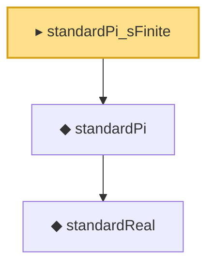

# Proof narrative — standardPi_sFinite

Root: **standardPi_sFinite** (instance) `Statlib/StatFoundation/RandomVariable/Gaussian/LogSobolev.lean:11145` · topic `StatFoundation`
Closure: 3 declarations across 2 files. Generated from `proof_graph.json` — no files were moved.

Reading order (foundations first, headline last):

    ◆ `standardReal` — abbrev · `Statlib/StatFoundation/RandomVariable/Gaussian/Standard.lean:31`  _(also used by 81: single_square_law, wald_statistic_asymptotic_chisq1, score_statistic_asymptotic_chisq1, …)_
  ◆ `standardPi` — def · `Statlib/StatFoundation/RandomVariable/Gaussian/Standard.lean:34`  _(also used by 23: one_sample_t_test, standardPi_logSobolev_smooth_finiteFisher, standardPi_integral_finCons, …)_
▸ `standardPi_sFinite` — instance · `Statlib/StatFoundation/RandomVariable/Gaussian/LogSobolev.lean:11145` **← headline**

## Dependency diagram

