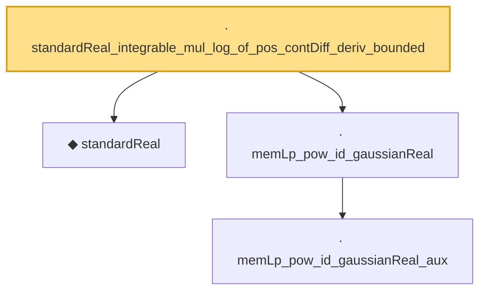

# Proof narrative — standardReal_integrable_mul_log_of_pos_contDiff_deriv_bounded

Root: **standardReal_integrable_mul_log_of_pos_contDiff_deriv_bounded** (lemma) `Statlib/StatFoundation/RandomVariable/Gaussian/LogSobolev.lean:74` · topic `StatFoundation`
Closure: 4 declarations across 2 files. Generated from `proof_graph.json` — no files were moved.

Reading order (foundations first, headline last):

  ◆ `standardReal` — abbrev · `Statlib/StatFoundation/RandomVariable/Gaussian/Standard.lean:31`  _(also used by 48: memLp_aeval_intPolynomial_standard, integrable_aeval_intPolynomial_standard, memLp_hermite_eval_mul, …)_
    · `memLp_pow_id_gaussianReal_aux` — private lemma · `Statlib/StatFoundation/RandomVariable/Gaussian/Standard.lean:114`
  · `memLp_pow_id_gaussianReal` — lemma · `Statlib/StatFoundation/RandomVariable/Gaussian/Standard.lean:139`  _(also used by 4: standardReal_integrationByParts_smooth_bddDeriv, standardReal_ou_mehler_log_growth_local_pos, standardReal_ou_mehler_generator_pos, …)_
· `standardReal_integrable_mul_log_of_pos_contDiff_deriv_bounded` — lemma · `Statlib/StatFoundation/RandomVariable/Gaussian/LogSobolev.lean:74` **← headline**

## Dependency diagram

