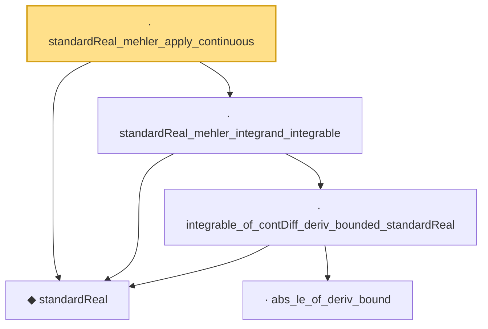

# Proof narrative — standardReal_mehler_apply_continuous

Root: **standardReal_mehler_apply_continuous** (lemma) `Statlib/StatFoundation/RandomVariable/Gaussian/LogSobolev.lean:1427` · topic `StatFoundation`
Closure: 5 declarations across 2 files. Generated from `proof_graph.json` — no files were moved.

Reading order (foundations first, headline last):

  ◆ `standardReal` — abbrev · `Statlib/StatFoundation/RandomVariable/Gaussian/Standard.lean:31`  _(also used by 46: memLp_aeval_intPolynomial_standard, integrable_aeval_intPolynomial_standard, memLp_hermite_eval_mul, …)_
      · `abs_le_of_deriv_bound` — lemma · `Statlib/StatFoundation/RandomVariable/Gaussian/LogSobolev.lean:22`  _(also used by 4: standardReal_integrationByParts_smooth_bddDeriv, standardReal_mehler_apply_contDiff, standardReal_ou_mehler_log_growth_local_pos, …)_
    · `integrable_of_contDiff_deriv_bounded_standardReal` — lemma · `Statlib/StatFoundation/RandomVariable/Gaussian/LogSobolev.lean:44`  _(also used by 3: standardReal_integrationByParts_smooth_bddDeriv, standardReal_ou_mehler_log_growth_pos, standardReal_ou_mehler_generator_pos)_
  · `standardReal_mehler_integrand_integrable` — lemma · `Statlib/StatFoundation/RandomVariable/Gaussian/LogSobolev.lean:1311`  _(also used by 4: standardReal_mehler_apply_pos, standardReal_ou_mehler_log_growth_pos, standardReal_ou_mehler_log_growth_local_pos, …)_
· `standardReal_mehler_apply_continuous` — lemma · `Statlib/StatFoundation/RandomVariable/Gaussian/LogSobolev.lean:1427` **← headline**

## Dependency diagram

