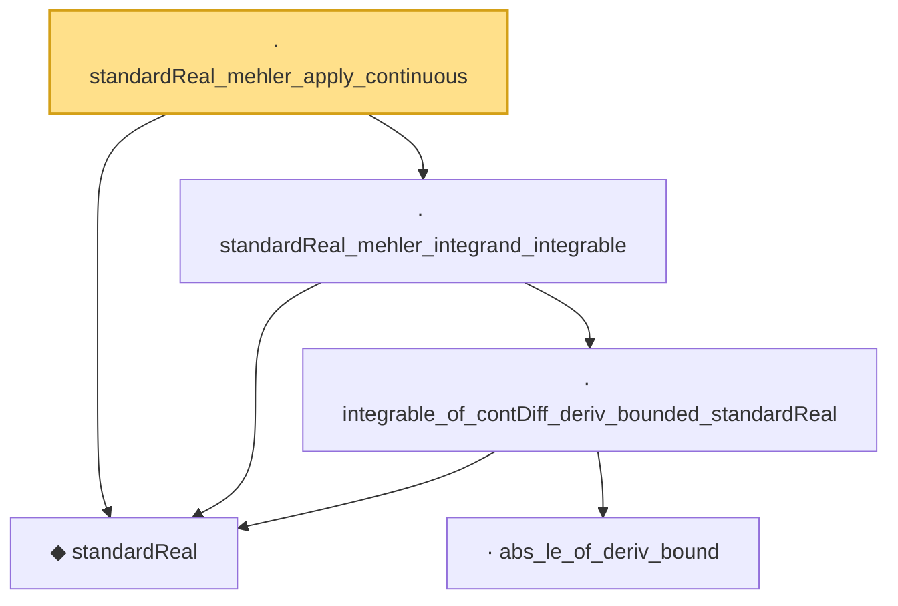

# Proof narrative — standardReal_mehler_apply_continuous

Root: **standardReal_mehler_apply_continuous** (lemma) `Statlib/StatFoundation/RandomVariable/Gaussian/LogSobolev.lean:1694` · topic `StatFoundation`
Closure: 5 declarations across 2 files. Generated from `proof_graph.json` — no files were moved.

Reading order (foundations first, headline last):

  ◆ `standardReal` — abbrev · `Statlib/StatFoundation/RandomVariable/Gaussian/Standard.lean:31`  _(also used by 79: single_square_law, wald_statistic_asymptotic_chisq1, score_statistic_asymptotic_chisq1, …)_
      · `abs_le_of_deriv_bound` — lemma · `Statlib/StatFoundation/RandomVariable/Gaussian/LogSobolev.lean:28`  _(also used by 6: standardReal_integrationByParts_smooth_bddDeriv, standardReal_mehler_apply_contDiff, standardReal_ou_mehler_log_growth_local_pos, …)_
    · `integrable_of_contDiff_deriv_bounded_standardReal` — lemma · `Statlib/StatFoundation/RandomVariable/Gaussian/LogSobolev.lean:50`  _(also used by 8: standardReal_integrationByParts_smooth_bddDeriv, standardReal_ou_mehler_log_growth_pos, standardReal_ou_mehler_time_deriv_linear_bound_pos, …)_
  · `standardReal_mehler_integrand_integrable` — lemma · `Statlib/StatFoundation/RandomVariable/Gaussian/LogSobolev.lean:1578`  _(also used by 11: standardReal_mehler_apply_pos, standardReal_ou_mehler_log_growth_pos, standardReal_ou_mehler_log_growth_local_pos, …)_
· `standardReal_mehler_apply_continuous` — lemma · `Statlib/StatFoundation/RandomVariable/Gaussian/LogSobolev.lean:1694` **← headline**

## Dependency diagram

```mermaid
flowchart TD
  n0["◆ standardReal"]
  n1["· abs_le_of_deriv_bound"]
  n2["· integrable_of_contDiff_deriv_bounded_standardReal"]
  n3["· standardReal_mehler_integrand_integrable"]
  n4["· standardReal_mehler_apply_continuous"]
  n2 --> n0
  n2 --> n1
  n3 --> n0
  n3 --> n2
  n4 --> n0
  n4 --> n3
  class n4 headline;
  classDef headline fill:#ffe08a,stroke:#d4a017,stroke-width:2px;
  classDef axiomNode fill:#ffd0d0,stroke:#c0392b,stroke-dasharray:4 2;
```
