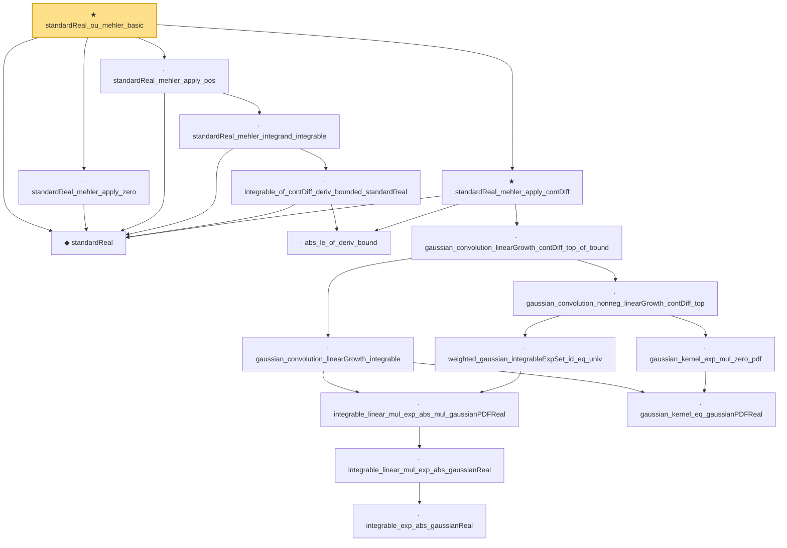

# Proof narrative — standardReal_ou_mehler_basic

Root: **standardReal_ou_mehler_basic** (theorem) `Statlib/StatFoundation/RandomVariable/Gaussian/LogSobolev.lean:1822` · topic `StatFoundation`
Closure: 17 declarations across 2 files. Generated from `proof_graph.json` — no files were moved.

Reading order (foundations first, headline last):

  ◆ `standardReal` — abbrev · `Statlib/StatFoundation/RandomVariable/Gaussian/Standard.lean:31`  _(also used by 43: memLp_aeval_intPolynomial_standard, integrable_aeval_intPolynomial_standard, memLp_hermite_eval_mul, …)_
    · `abs_le_of_deriv_bound` — lemma · `Statlib/StatFoundation/RandomVariable/Gaussian/LogSobolev.lean:22`  _(also used by 3: standardReal_integrationByParts_smooth_bddDeriv, standardReal_ou_mehler_log_growth_local_pos, standardReal_ou_mehler_generator_pos)_
            · `integrable_exp_abs_gaussianReal` — lemma · `Statlib/StatFoundation/RandomVariable/Gaussian/LogSobolev.lean:652`  _(also used by 1: integrable_quadratic_mul_exp_abs_gaussianReal)_
            · `integrable_linear_mul_exp_abs_gaussianReal` — lemma · `Statlib/StatFoundation/RandomVariable/Gaussian/LogSobolev.lean:681`  _(also used by 1: integrable_linear_mul_exp_abs_standard)_
        · `integrable_linear_mul_exp_abs_mul_gaussianPDFReal` — lemma · `Statlib/StatFoundation/RandomVariable/Gaussian/LogSobolev.lean:761`
        · `weighted_gaussian_integrableExpSet_id_eq_univ` — lemma · `Statlib/StatFoundation/RandomVariable/Gaussian/LogSobolev.lean:933`
        · `gaussian_kernel_eq_gaussianPDFReal` — lemma · `Statlib/StatFoundation/RandomVariable/Gaussian/LogSobolev.lean:887`
        · `gaussian_kernel_exp_mul_zero_pdf` — lemma · `Statlib/StatFoundation/RandomVariable/Gaussian/LogSobolev.lean:912`
      · `gaussian_convolution_nonneg_linearGrowth_contDiff_top` — lemma · `Statlib/StatFoundation/RandomVariable/Gaussian/LogSobolev.lean:1070`
      · `gaussian_convolution_linearGrowth_integrable` — lemma · `Statlib/StatFoundation/RandomVariable/Gaussian/LogSobolev.lean:997`
    · `gaussian_convolution_linearGrowth_contDiff_top_of_bound` — lemma · `Statlib/StatFoundation/RandomVariable/Gaussian/LogSobolev.lean:1148`
  ★ `standardReal_mehler_apply_contDiff` — theorem · `Statlib/StatFoundation/RandomVariable/Gaussian/LogSobolev.lean:1564`  _(also used by 1: standardReal_ou_mehler_generator_pos)_
      · `integrable_of_contDiff_deriv_bounded_standardReal` — lemma · `Statlib/StatFoundation/RandomVariable/Gaussian/LogSobolev.lean:44`  _(also used by 3: standardReal_integrationByParts_smooth_bddDeriv, standardReal_ou_mehler_log_growth_pos, standardReal_ou_mehler_generator_pos)_
    · `standardReal_mehler_integrand_integrable` — lemma · `Statlib/StatFoundation/RandomVariable/Gaussian/LogSobolev.lean:1311`  _(also used by 4: standardReal_mehler_apply_continuous, standardReal_ou_mehler_log_growth_pos, standardReal_ou_mehler_log_growth_local_pos, …)_
  · `standardReal_mehler_apply_pos` — lemma · `Statlib/StatFoundation/RandomVariable/Gaussian/LogSobolev.lean:1394`  _(also used by 2: standardReal_ou_mehler_log_growth_pos, standardReal_ou_mehler_log_growth_local_pos)_
  · `standardReal_mehler_apply_zero` — lemma · `Statlib/StatFoundation/RandomVariable/Gaussian/LogSobolev.lean:1385`
★ `standardReal_ou_mehler_basic` — theorem · `Statlib/StatFoundation/RandomVariable/Gaussian/LogSobolev.lean:1822` **← headline**

## Dependency diagram

