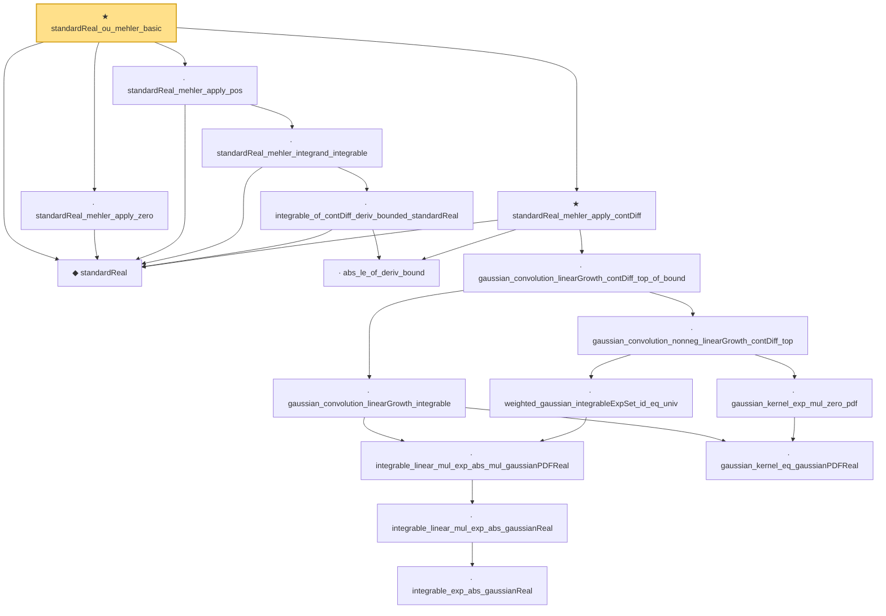

# Proof narrative — standardReal_ou_mehler_basic

Root: **standardReal_ou_mehler_basic** (theorem) `Statlib/StatFoundation/RandomVariable/Gaussian/LogSobolev.lean:2089` · topic `StatFoundation`
Closure: 17 declarations across 2 files. Generated from `proof_graph.json` — no files were moved.

Reading order (foundations first, headline last):

  ◆ `standardReal` — abbrev · `Statlib/StatFoundation/RandomVariable/Gaussian/Standard.lean:31`  _(also used by 76: single_square_law, wald_statistic_asymptotic_chisq1, score_statistic_asymptotic_chisq1, …)_
    · `abs_le_of_deriv_bound` — lemma · `Statlib/StatFoundation/RandomVariable/Gaussian/LogSobolev.lean:28`  _(also used by 5: standardReal_integrationByParts_smooth_bddDeriv, standardReal_ou_mehler_log_growth_local_pos, standardReal_ou_mehler_generator_pos, …)_
            · `integrable_exp_abs_gaussianReal` — lemma · `Statlib/StatFoundation/RandomVariable/Gaussian/LogSobolev.lean:659`  _(also used by 1: integrable_quadratic_mul_exp_abs_gaussianReal)_
            · `integrable_linear_mul_exp_abs_gaussianReal` — lemma · `Statlib/StatFoundation/RandomVariable/Gaussian/LogSobolev.lean:688`  _(also used by 1: integrable_linear_mul_exp_abs_standard)_
        · `integrable_linear_mul_exp_abs_mul_gaussianPDFReal` — lemma · `Statlib/StatFoundation/RandomVariable/Gaussian/LogSobolev.lean:768`
        · `weighted_gaussian_integrableExpSet_id_eq_univ` — lemma · `Statlib/StatFoundation/RandomVariable/Gaussian/LogSobolev.lean:940`
        · `gaussian_kernel_eq_gaussianPDFReal` — lemma · `Statlib/StatFoundation/RandomVariable/Gaussian/LogSobolev.lean:894`  _(also used by 2: standardPi_logSobolev_smooth_finiteFisher, standardPi_logSobolev_smooth_finiteFisher_coord)_
        · `gaussian_kernel_exp_mul_zero_pdf` — lemma · `Statlib/StatFoundation/RandomVariable/Gaussian/LogSobolev.lean:919`
      · `gaussian_convolution_nonneg_linearGrowth_contDiff_top` — lemma · `Statlib/StatFoundation/RandomVariable/Gaussian/LogSobolev.lean:1077`
      · `gaussian_convolution_linearGrowth_integrable` — lemma · `Statlib/StatFoundation/RandomVariable/Gaussian/LogSobolev.lean:1004`
    · `gaussian_convolution_linearGrowth_contDiff_top_of_bound` — lemma · `Statlib/StatFoundation/RandomVariable/Gaussian/LogSobolev.lean:1155`  _(also used by 2: standardPi_logSobolev_smooth_finiteFisher, standardPi_logSobolev_smooth_finiteFisher_coord)_
  ★ `standardReal_mehler_apply_contDiff` — theorem · `Statlib/StatFoundation/RandomVariable/Gaussian/LogSobolev.lean:1831`  _(also used by 6: standardReal_ou_mehler_entropy_derivative_pos, standardReal_ou_mehler_generator_pos, standardReal_ou_mehler_generator_memLp_two_pos, …)_
      · `integrable_of_contDiff_deriv_bounded_standardReal` — lemma · `Statlib/StatFoundation/RandomVariable/Gaussian/LogSobolev.lean:50`  _(also used by 8: standardReal_integrationByParts_smooth_bddDeriv, standardReal_ou_mehler_log_growth_pos, standardReal_ou_mehler_time_deriv_linear_bound_pos, …)_
    · `standardReal_mehler_integrand_integrable` — lemma · `Statlib/StatFoundation/RandomVariable/Gaussian/LogSobolev.lean:1578`  _(also used by 11: standardReal_mehler_apply_continuous, standardReal_ou_mehler_log_growth_pos, standardReal_ou_mehler_log_growth_local_pos, …)_
  · `standardReal_mehler_apply_pos` — lemma · `Statlib/StatFoundation/RandomVariable/Gaussian/LogSobolev.lean:1661`  _(also used by 8: standardReal_ou_mehler_log_growth_pos, standardReal_ou_mehler_log_growth_local_pos, standardReal_ou_mehler_entropy_integrand_hasDerivAt_pos, …)_
  · `standardReal_mehler_apply_zero` — lemma · `Statlib/StatFoundation/RandomVariable/Gaussian/LogSobolev.lean:1652`  _(also used by 5: standardReal_ou_mehler_integral_invariant, standardReal_ou_mehler_fisher_decay_pos_of_fisher_integrable, standardReal_logSobolev_smooth_normalized_finiteFisher, …)_
★ `standardReal_ou_mehler_basic` — theorem · `Statlib/StatFoundation/RandomVariable/Gaussian/LogSobolev.lean:2089` **← headline**

## Dependency diagram

```mermaid
flowchart TD
  n0["◆ standardReal"]
  n1["· abs_le_of_deriv_bound"]
  n2["· integrable_exp_abs_gaussianReal"]
  n3["· integrable_linear_mul_exp_abs_gaussianReal"]
  n4["· integrable_linear_mul_exp_abs_mul_gaussianPDFReal"]
  n5["· weighted_gaussian_integrableExpSet_id_eq_univ"]
  n6["· gaussian_kernel_eq_gaussianPDFReal"]
  n7["· gaussian_kernel_exp_mul_zero_pdf"]
  n8["· gaussian_convolution_nonneg_linearGrowth_contDiff_top"]
  n9["· gaussian_convolution_linearGrowth_integrable"]
  n10["· gaussian_convolution_linearGrowth_contDiff_top_of_bound"]
  n11["★ standardReal_mehler_apply_contDiff"]
  n12["· integrable_of_contDiff_deriv_bounded_standardReal"]
  n13["· standardReal_mehler_integrand_integrable"]
  n14["· standardReal_mehler_apply_pos"]
  n15["· standardReal_mehler_apply_zero"]
  n16["★ standardReal_ou_mehler_basic"]
  n3 --> n2
  n4 --> n3
  n5 --> n4
  n7 --> n6
  n8 --> n5
  n8 --> n7
  n9 --> n4
  n9 --> n6
  n10 --> n8
  n10 --> n9
  n11 --> n0
  n11 --> n1
  n11 --> n10
  n12 --> n0
  n12 --> n1
  n13 --> n0
  n13 --> n12
  n14 --> n0
  n14 --> n13
  n15 --> n0
  n16 --> n0
  n16 --> n11
  n16 --> n14
  n16 --> n15
  class n16 headline;
  classDef headline fill:#ffe08a,stroke:#d4a017,stroke-width:2px;
  classDef axiomNode fill:#ffd0d0,stroke:#c0392b,stroke-dasharray:4 2;
```
