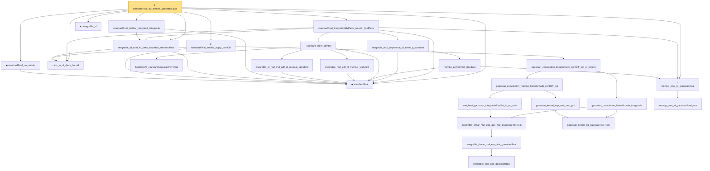

# Proof narrative — standardReal_ou_mehler_generator_pos

Root: **standardReal_ou_mehler_generator_pos** (theorem) `Statlib/StatFoundation/RandomVariable/Gaussian/LogSobolev.lean:3250` · topic `StatFoundation`
Closure: 26 declarations across 5 files. Generated from `proof_graph.json` — no files were moved.

Reading order (foundations first, headline last):

  ◆ `standardReal` — abbrev · `Statlib/StatFoundation/RandomVariable/Gaussian/Standard.lean:31`  _(also used by 38: memLp_aeval_intPolynomial_standard, integrable_aeval_intPolynomial_standard, memLp_hermite_eval_mul, …)_
  ◆ `standardReal_ou_mehler` — def · `Statlib/StatFoundation/RandomVariable/Gaussian/LogSobolev.lean:1294`  _(also used by 2: standardReal_ou_mehler_log_growth_pos, standardReal_ou_mehler_log_growth_local_pos)_
  · `abs_le_of_deriv_bound` — lemma · `Statlib/StatFoundation/RandomVariable/Gaussian/LogSobolev.lean:22`  _(also used by 1: standardReal_ou_mehler_log_growth_local_pos)_
            · `integrable_exp_abs_gaussianReal` — lemma · `Statlib/StatFoundation/RandomVariable/Gaussian/LogSobolev.lean:652`  _(also used by 1: integrable_quadratic_mul_exp_abs_gaussianReal)_
            · `integrable_linear_mul_exp_abs_gaussianReal` — lemma · `Statlib/StatFoundation/RandomVariable/Gaussian/LogSobolev.lean:681`  _(also used by 1: integrable_linear_mul_exp_abs_standard)_
        · `integrable_linear_mul_exp_abs_mul_gaussianPDFReal` — lemma · `Statlib/StatFoundation/RandomVariable/Gaussian/LogSobolev.lean:761`
        · `weighted_gaussian_integrableExpSet_id_eq_univ` — lemma · `Statlib/StatFoundation/RandomVariable/Gaussian/LogSobolev.lean:933`
        · `gaussian_kernel_eq_gaussianPDFReal` — lemma · `Statlib/StatFoundation/RandomVariable/Gaussian/LogSobolev.lean:887`
        · `gaussian_kernel_exp_mul_zero_pdf` — lemma · `Statlib/StatFoundation/RandomVariable/Gaussian/LogSobolev.lean:912`
      · `gaussian_convolution_nonneg_linearGrowth_contDiff_top` — lemma · `Statlib/StatFoundation/RandomVariable/Gaussian/LogSobolev.lean:1070`
      · `gaussian_convolution_linearGrowth_integrable` — lemma · `Statlib/StatFoundation/RandomVariable/Gaussian/LogSobolev.lean:997`
    · `gaussian_convolution_linearGrowth_contDiff_top_of_bound` — lemma · `Statlib/StatFoundation/RandomVariable/Gaussian/LogSobolev.lean:1148`
  ★ `standardReal_mehler_apply_contDiff` — theorem · `Statlib/StatFoundation/RandomVariable/Gaussian/LogSobolev.lean:1564`  _(also used by 1: standardReal_ou_mehler_basic)_
  · `integrable_of_contDiff_deriv_bounded_standardReal` — lemma · `Statlib/StatFoundation/RandomVariable/Gaussian/LogSobolev.lean:44`  _(also used by 1: standardReal_ou_mehler_log_growth_pos)_
  · `standardReal_mehler_integrand_integrable` — lemma · `Statlib/StatFoundation/RandomVariable/Gaussian/LogSobolev.lean:1311`  _(also used by 4: standardReal_mehler_apply_pos, standardReal_mehler_apply_continuous, standardReal_ou_mehler_log_growth_pos, …)_
      · `memLp_pow_id_gaussianReal_aux` — private lemma · `Statlib/StatFoundation/RandomVariable/Gaussian/Standard.lean:114`
  · `memLp_pow_id_gaussianReal` — lemma · `Statlib/StatFoundation/RandomVariable/Gaussian/Standard.lean:139`  _(also used by 2: standardReal_integrable_mul_log_of_pos_contDiff_deriv_bounded, standardReal_ou_mehler_log_growth_local_pos)_
      · `hasDerivAt_standardGaussianPDFReal` — lemma · `Statlib/StatFoundation/RandomVariable/Gaussian/Standard.lean:178`  _(also used by 1: hasDerivAt_hermite_eval_mul_gaussianPDF)_
      · `integrable_id_mul_mul_pdf_of_memLp_standard` — lemma · `Statlib/StatFoundation/RandomVariable/Gaussian/Standard.lean:96`
      · `integrable_mul_pdf_of_memLp_standard` — lemma · `Statlib/StatFoundation/RandomVariable/Gaussian/Standard.lean:84`
    · `standard_stein_identity` — lemma · `Statlib/StatFoundation/RandomVariable/Gaussian/Stein.lean:25`  _(also used by 3: integral_hermite_eval_eq_zero, integral_hermite_eval_mul_succ, standard_stein_identity_of_lipschitz)_
      · `memLp_polynomial_standard` — lemma · `Statlib/StatFoundation/RandomVariable/Gaussian/Standard.lean:144`  _(also used by 2: memLp_aeval_intPolynomial_standard, integrable_polynomial_mul_pdf_standard)_
    · `integrable_mul_polynomial_of_memLp_standard` — lemma · `Statlib/StatFoundation/RandomVariable/Gaussian/Hermite.lean:302`  _(also used by 1: integral_polynomial_mul_eq_zero_of_moments)_
  · `standardReal_integrationByParts_smooth_bddDeriv` — lemma · `Statlib/StatFoundation/RandomVariable/Gaussian/LogSobolev.lean:195`
  ★ `integrable_id` — theorem · `Statlib/StatFoundation/RandomVariable/Gaussian/HilbertSpace.lean:253`
★ `standardReal_ou_mehler_generator_pos` — theorem · `Statlib/StatFoundation/RandomVariable/Gaussian/LogSobolev.lean:3250` **← headline**

## Dependency diagram

