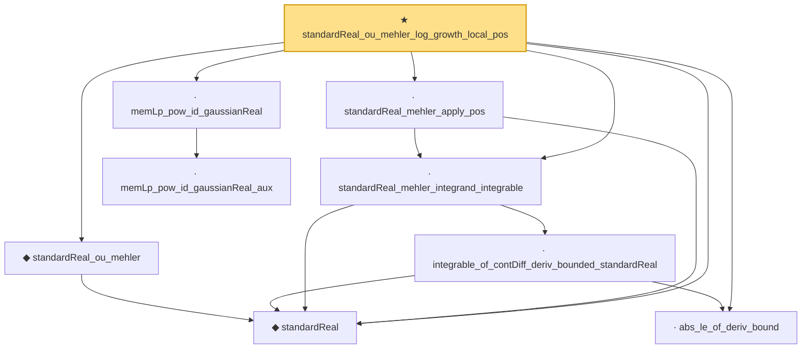

# Proof narrative — standardReal_ou_mehler_log_growth_local_pos

Root: **standardReal_ou_mehler_log_growth_local_pos** (theorem) `Statlib/StatFoundation/RandomVariable/Gaussian/LogSobolev.lean:2488` · topic `StatFoundation`
Closure: 9 declarations across 2 files. Generated from `proof_graph.json` — no files were moved.

Reading order (foundations first, headline last):

  ◆ `standardReal` — abbrev · `Statlib/StatFoundation/RandomVariable/Gaussian/Standard.lean:31`  _(also used by 44: memLp_aeval_intPolynomial_standard, integrable_aeval_intPolynomial_standard, memLp_hermite_eval_mul, …)_
  ◆ `standardReal_ou_mehler` — def · `Statlib/StatFoundation/RandomVariable/Gaussian/LogSobolev.lean:1294`  _(also used by 2: standardReal_ou_mehler_log_growth_pos, standardReal_ou_mehler_generator_pos)_
  · `abs_le_of_deriv_bound` — lemma · `Statlib/StatFoundation/RandomVariable/Gaussian/LogSobolev.lean:22`  _(also used by 3: standardReal_integrationByParts_smooth_bddDeriv, standardReal_mehler_apply_contDiff, standardReal_ou_mehler_generator_pos)_
      · `integrable_of_contDiff_deriv_bounded_standardReal` — lemma · `Statlib/StatFoundation/RandomVariable/Gaussian/LogSobolev.lean:44`  _(also used by 3: standardReal_integrationByParts_smooth_bddDeriv, standardReal_ou_mehler_log_growth_pos, standardReal_ou_mehler_generator_pos)_
  · `standardReal_mehler_integrand_integrable` — lemma · `Statlib/StatFoundation/RandomVariable/Gaussian/LogSobolev.lean:1311`  _(also used by 3: standardReal_mehler_apply_continuous, standardReal_ou_mehler_log_growth_pos, standardReal_ou_mehler_generator_pos)_
  · `standardReal_mehler_apply_pos` — lemma · `Statlib/StatFoundation/RandomVariable/Gaussian/LogSobolev.lean:1394`  _(also used by 2: standardReal_ou_mehler_basic, standardReal_ou_mehler_log_growth_pos)_
    · `memLp_pow_id_gaussianReal_aux` — private lemma · `Statlib/StatFoundation/RandomVariable/Gaussian/Standard.lean:114`
  · `memLp_pow_id_gaussianReal` — lemma · `Statlib/StatFoundation/RandomVariable/Gaussian/Standard.lean:139`  _(also used by 4: standardReal_integrable_mul_log_of_pos_contDiff_deriv_bounded, standardReal_integrationByParts_smooth_bddDeriv, standardReal_ou_mehler_generator_pos, …)_
★ `standardReal_ou_mehler_log_growth_local_pos` — theorem · `Statlib/StatFoundation/RandomVariable/Gaussian/LogSobolev.lean:2488` **← headline**

## Dependency diagram

