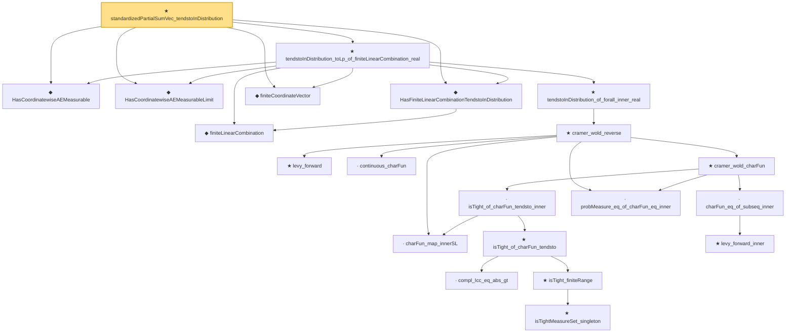

# Proof narrative — standardizedPartialSumVec_tendstoInDistribution

Root: **standardizedPartialSumVec_tendstoInDistribution** (theorem) `Statlib/StatFoundation/Convergence/CentralLimitTheorem/MaxType.lean:224` · topic `StatFoundation`
Closure: 21 declarations across 5 files. Generated from `proof_graph.json` — no files were moved.

Reading order (foundations first, headline last):

  ◆ `HasCoordinatewiseAEMeasurable` — abbrev · `Statlib/StatFoundation/Vocabulary/FiniteCoordinate.lean:33`  _(also used by 45: tendstoInDistribution_debiasedLasso_scaledCenteredFiniteCoordinate_of_linearScore_and_l1_rowApprox_real, tendstoInDistribution_studentizedDebiasedLasso_coordinate_of_linearScore_l1_rowApprox_and_se_real, tendstoInDistribution_debiasedLasso_scaledCenteredFiniteCoordinate_of_scoreVector_and_l1_rowApprox_real, …)_
  ◆ `HasCoordinatewiseAEMeasurableLimit` — abbrev · `Statlib/StatFoundation/Vocabulary/FiniteCoordinate.lean:38`  _(also used by 19: tendstoInDistribution_debiasedLasso_scaledCenteredFiniteCoordinate_of_linearScore_and_l1_rowApprox_real, tendstoInDistribution_studentizedDebiasedLasso_coordinate_of_linearScore_l1_rowApprox_and_se_real, tendstoInDistribution_debiasedLasso_scaledCenteredFiniteCoordinate_of_scoreVector_and_l1_rowApprox_real, …)_
    ◆ `finiteLinearCombination` — noncomputable abbrev · `Statlib/StatFoundation/Vocabulary/FiniteCoordinate.lean:29`  _(also used by 17: tendstoInDistribution_debiasedLasso_scaledCenteredFiniteCoordinate_of_linearScore_and_l1_rowApprox_real, hasFiniteLinearCombinationIsBigOInProbability_of_coordinatewise_real, hasFiniteLinearCombinationIsLittleOInProbability_of_coordinatewise_real, …)_
  ◆ `HasFiniteLinearCombinationTendstoInDistribution` — abbrev · `Statlib/StatFoundation/Vocabulary/FiniteCoordinate.lean:43`  _(also used by 22: tendstoInDistribution_debiasedLasso_scaledCenteredFiniteCoordinate_of_linearScore_and_l1_rowApprox_real, tendstoInDistribution_studentizedDebiasedLasso_coordinate_of_linearScore_l1_rowApprox_and_se_real, tendstoInDistribution_debiasedLasso_scaledCenteredFiniteCoordinate_of_scoreVector_and_l1_rowApprox_real, …)_
  ◆ `finiteCoordinateVector` — noncomputable abbrev · `Statlib/StatFoundation/Vocabulary/FiniteCoordinate.lean:25`  _(also used by 20: tendstoInDistribution_debiasedLasso_scaledCenteredFiniteCoordinate_of_linearScore_and_l1_rowApprox_real, tendstoInDistribution_debiasedLasso_scaledCenteredFiniteCoordinate_of_scoreVector_and_l1_rowApprox_real, tendstoInDistribution_studentizedDebiasedLasso_coordinate_of_scoreVector_l1_rowApprox_and_se_real, …)_
        ★ `levy_forward` — theorem · `Statlib/StatFoundation/Convergence/AnalysisTools/LevyContinuity.lean:31`  _(also used by 1: charFun_eq_of_subseq)_
        · `charFun_map_innerSL` — lemma · `Statlib/StatFoundation/Convergence/AnalysisTools/CramerWold.lean:22`
        · `continuous_charFun` — lemma · `Statlib/StatFoundation/Convergence/AnalysisTools/CramerWold.lean:39`
            · `compl_Icc_eq_abs_gt` — lemma · `Statlib/StatFoundation/Convergence/AnalysisTools/LevyContinuity.lean:15`
            ★ `isTightMeasureSet_singleton` — theorem · `Statlib/StatFoundation/Convergence/AnalysisTools/Tightness.lean:113`  _(also used by 1: isTightMeasureSet_finiteRange)_
            ★ `isTight_finiteRange` — theorem · `Statlib/StatFoundation/Convergence/AnalysisTools/Tightness.lean:18`  _(also used by 1: isTightMeasureSet_range_map_of_isBigOInProbability_one_real)_
            ★ `isTight_of_charFun_tendsto` — theorem · `Statlib/StatFoundation/Convergence/AnalysisTools/LevyContinuity.lean:44`  _(also used by 1: levy_continuity)_
          · `isTight_of_charFun_tendsto_inner` — lemma · `Statlib/StatFoundation/Convergence/AnalysisTools/CramerWold.lean:131`
            ★ `levy_forward_inner` — theorem · `Statlib/StatFoundation/Convergence/AnalysisTools/CramerWold.lean:61`
          · `charFun_eq_of_subseq_inner` — lemma · `Statlib/StatFoundation/Convergence/AnalysisTools/CramerWold.lean:99`
        · `probMeasure_eq_of_charFun_eq_inner` — lemma · `Statlib/StatFoundation/Convergence/AnalysisTools/CramerWold.lean:114`
        ★ `cramer_wold_charFun` — theorem · `Statlib/StatFoundation/Convergence/AnalysisTools/CramerWold.lean:261`
      ★ `cramer_wold_reverse` — theorem · `Statlib/StatFoundation/Convergence/AnalysisTools/CramerWold.lean:297`  _(also used by 1: cramer_wold_iff)_
    ★ `tendstoInDistribution_of_forall_inner_real` — theorem · `Statlib/StatFoundation/Convergence/AnalysisTools/CramerWold.lean:348`  _(also used by 1: tendstoInDistribution_iff_forall_inner_real)_
  ★ `tendstoInDistribution_toLp_of_finiteLinearCombination_real` — theorem · `Statlib/StatFoundation/Convergence/AnalysisTools/CramerWold.lean:409`  _(also used by 4: tendstoInDistribution_toLp_iff_finiteLinearCombination_real, tendstoInDistribution_toLp_of_finiteLinearCombination_remainder_tendstoInMeasure_real, maxCoord_standardizedPartialSum_tendsto, …)_
★ `standardizedPartialSumVec_tendstoInDistribution` — theorem · `Statlib/StatFoundation/Convergence/CentralLimitTheorem/MaxType.lean:224` **← headline**

## Dependency diagram

