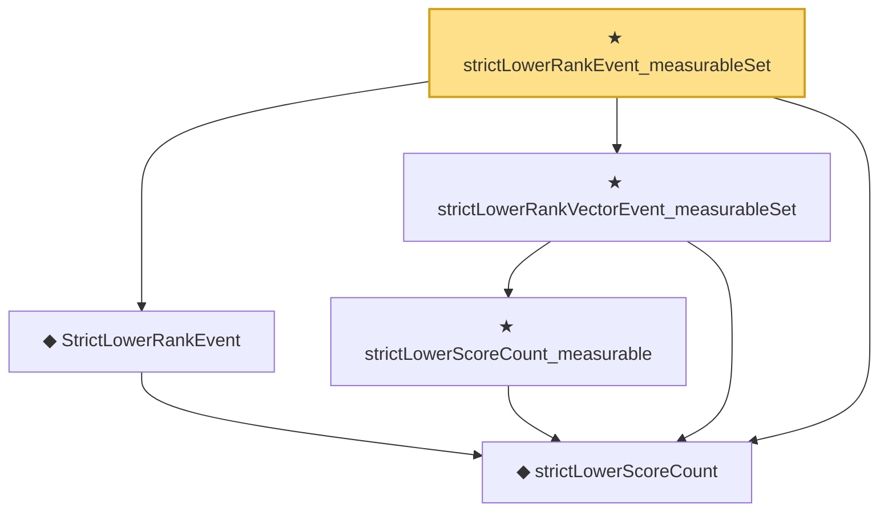

# Proof narrative — strictLowerRankEvent_measurableSet

Root: **strictLowerRankEvent_measurableSet** (theorem) `Statlib/StatFoundation/Statistics/Conformal.lean:81` · topic `StatFoundation`
Closure: 5 declarations across 2 files. Generated from `proof_graph.json` — no files were moved.

Reading order (foundations first, headline last):

  ◆ `strictLowerScoreCount` — noncomputable def · `Statlib/StatFoundation/Vocabulary/Conformal.lean:45`
  ◆ `StrictLowerRankEvent` — noncomputable def · `Statlib/StatFoundation/Vocabulary/Conformal.lean:50`  _(also used by 1: RankEventsEquiprobable)_
    ★ `strictLowerScoreCount_measurable` — theorem · `Statlib/StatFoundation/Statistics/Conformal.lean:53`
  ★ `strictLowerRankVectorEvent_measurableSet` — theorem · `Statlib/StatFoundation/Statistics/Conformal.lean:76`
★ `strictLowerRankEvent_measurableSet` — theorem · `Statlib/StatFoundation/Statistics/Conformal.lean:81` **← headline**

## Dependency diagram

