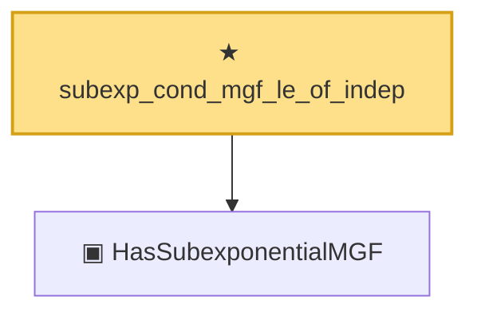

# Proof narrative — subexp_cond_mgf_le_of_indep

Root: **subexp_cond_mgf_le_of_indep** (theorem) `Statlib/StatFoundation/RandomVariable/SubExponential/subexp_cond_mgf_le_of_indep.lean:24` · topic `StatFoundation`
Closure: 2 declarations across 2 files. Generated from `proof_graph.json` — no files were moved.

Reading order (foundations first, headline last):

  ▣ `HasSubexponentialMGF` — structure · `Statlib/StatFoundation/Vocabulary/RandomVariable.lean:74`  _(also used by 32: coord_mul_subexponential_exists_of_indep, subexponential_mgf_const_mul_relaxed, coord_mul_scaled_subexponential_exists_of_indep, …)_
★ `subexp_cond_mgf_le_of_indep` — theorem · `Statlib/StatFoundation/RandomVariable/SubExponential/subexp_cond_mgf_le_of_indep.lean:24` **← headline**

## Dependency diagram

