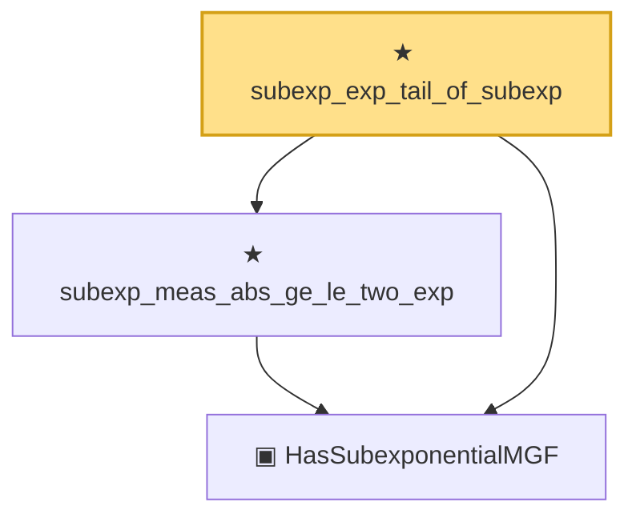

# Proof narrative — subexp_exp_tail_of_subexp

Root: **subexp_exp_tail_of_subexp** (theorem) `Statlib/StatFoundation/RandomVariable/SubExponential/subexp_exp_tail_of_subexp.lean:27` · topic `StatFoundation`
Closure: 3 declarations across 3 files. Generated from `proof_graph.json` — no files were moved.

Reading order (foundations first, headline last):

  ▣ `HasSubexponentialMGF` — structure · `Statlib/StatFoundation/Vocabulary/RandomVariable.lean:74`  _(also used by 31: coord_mul_subexponential_exists_of_indep, subexponential_mgf_const_mul_relaxed, coord_mul_scaled_subexponential_exists_of_indep, …)_
  ★ `subexp_meas_abs_ge_le_two_exp` — theorem · `Statlib/StatFoundation/RandomVariable/SubExponential/subexp_meas_abs_ge_le_two_exp.lean:12`  _(also used by 1: isotropic_norm_concentration)_
★ `subexp_exp_tail_of_subexp` — theorem · `Statlib/StatFoundation/RandomVariable/SubExponential/subexp_exp_tail_of_subexp.lean:27` **← headline**

## Dependency diagram

