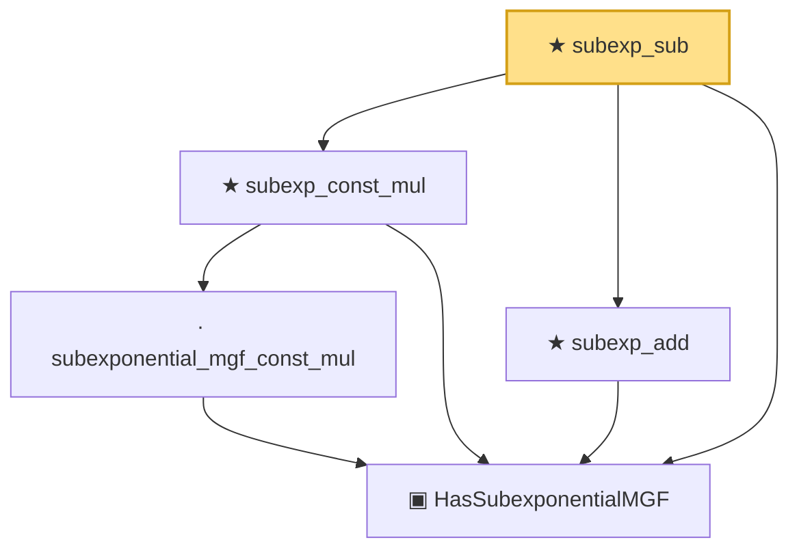

# Proof narrative — subexp_sub

Root: **subexp_sub** (theorem) `Statlib/StatFoundation/RandomVariable/SubExponential/subexp_closure.lean:578` · topic `StatFoundation`
Closure: 5 declarations across 3 files. Generated from `proof_graph.json` — no files were moved.

Reading order (foundations first, headline last):

  ▣ `HasSubexponentialMGF` — structure · `Statlib/StatFoundation/Vocabulary/RandomVariable.lean:74`  _(also used by 29: coord_mul_subexponential_exists_of_indep, subexponential_mgf_const_mul_relaxed, coord_mul_scaled_subexponential_exists_of_indep, …)_
    · `subexponential_mgf_const_mul` — lemma · `Statlib/StatFoundation/RandomVariable/SubExponential/subexponential_mgf_const_mul.lean:12`
  ★ `subexp_const_mul` — theorem · `Statlib/StatFoundation/RandomVariable/SubExponential/subexp_closure.lean:42`
  ★ `subexp_add` — theorem · `Statlib/StatFoundation/RandomVariable/SubExponential/subexp_closure.lean:105`
★ `subexp_sub` — theorem · `Statlib/StatFoundation/RandomVariable/SubExponential/subexp_closure.lean:578` **← headline**

## Dependency diagram

