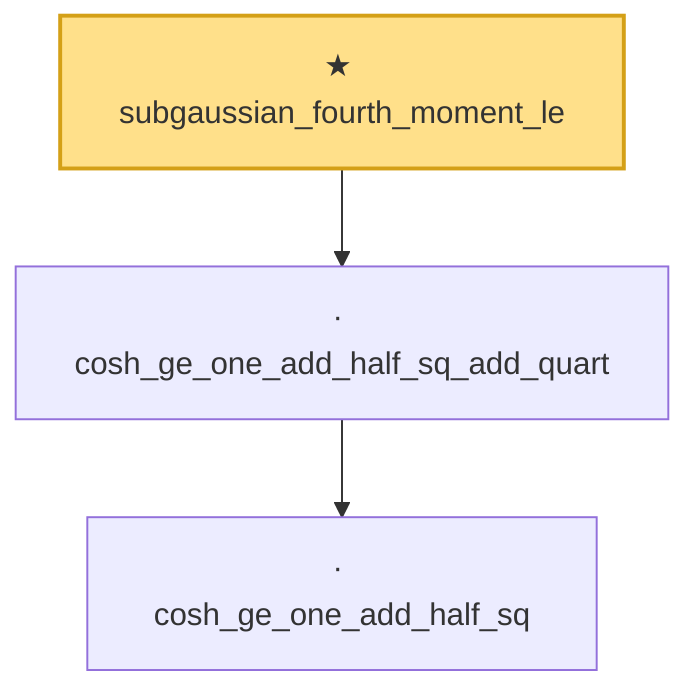

# Proof narrative — subgaussian_fourth_moment_le

Root: **subgaussian_fourth_moment_le** (theorem) `Statlib/StatFoundation/RandomVariable/SubGaussian/subgaussian_fourth_moment_le.lean:112` · topic `StatFoundation`
Closure: 3 declarations across 1 files. Generated from `proof_graph.json` — no files were moved.

Reading order (foundations first, headline last):

    · `cosh_ge_one_add_half_sq` — lemma · `Statlib/StatFoundation/RandomVariable/SubGaussian/subgaussian_fourth_moment_le.lean:8`  _(also used by 1: subgaussian_rip_tail)_
  · `cosh_ge_one_add_half_sq_add_quart` — lemma · `Statlib/StatFoundation/RandomVariable/SubGaussian/subgaussian_fourth_moment_le.lean:34`
★ `subgaussian_fourth_moment_le` — theorem · `Statlib/StatFoundation/RandomVariable/SubGaussian/subgaussian_fourth_moment_le.lean:112` **← headline**

## Dependency diagram

