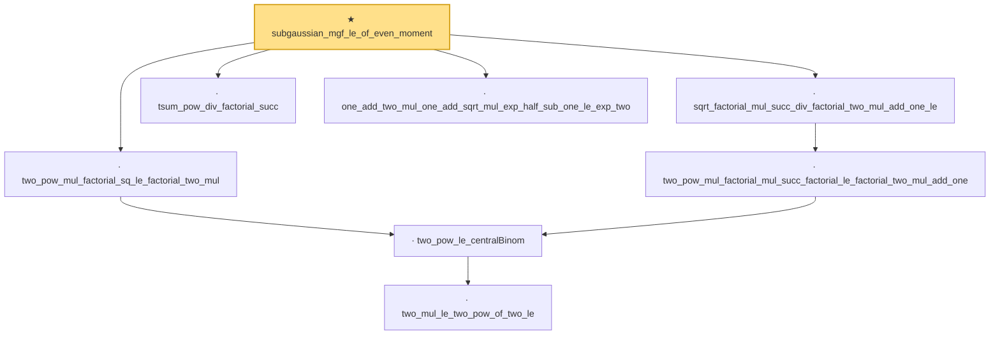

# Proof narrative — subgaussian_mgf_le_of_even_moment

Root: **subgaussian_mgf_le_of_even_moment** (theorem) `Statlib/StatFoundation/RandomVariable/SubGaussian/subgaussian_mgf_le_of_even_moment.lean:183` · topic `StatFoundation`
Closure: 8 declarations across 1 files. Generated from `proof_graph.json` — no files were moved.

Reading order (foundations first, headline last):

      · `two_mul_le_two_pow_of_two_le` — private lemma · `Statlib/StatFoundation/RandomVariable/SubGaussian/subgaussian_mgf_le_of_even_moment.lean:10`
    · `two_pow_le_centralBinom` — private lemma · `Statlib/StatFoundation/RandomVariable/SubGaussian/subgaussian_mgf_le_of_even_moment.lean:28`
  · `two_pow_mul_factorial_sq_le_factorial_two_mul` — private lemma · `Statlib/StatFoundation/RandomVariable/SubGaussian/subgaussian_mgf_le_of_even_moment.lean:51`
    · `two_pow_mul_factorial_mul_succ_factorial_le_factorial_two_mul_add_one` — private lemma · `Statlib/StatFoundation/RandomVariable/SubGaussian/subgaussian_mgf_le_of_even_moment.lean:66`
  · `sqrt_factorial_mul_succ_div_factorial_two_mul_add_one_le` — private lemma · `Statlib/StatFoundation/RandomVariable/SubGaussian/subgaussian_mgf_le_of_even_moment.lean:82`
  · `tsum_pow_div_factorial_succ` — private lemma · `Statlib/StatFoundation/RandomVariable/SubGaussian/subgaussian_mgf_le_of_even_moment.lean:117`
  · `one_add_two_mul_one_add_sqrt_mul_exp_half_sub_one_le_exp_two` — private lemma · `Statlib/StatFoundation/RandomVariable/SubGaussian/subgaussian_mgf_le_of_even_moment.lean:127`
★ `subgaussian_mgf_le_of_even_moment` — theorem · `Statlib/StatFoundation/RandomVariable/SubGaussian/subgaussian_mgf_le_of_even_moment.lean:183` **← headline**

## Dependency diagram

