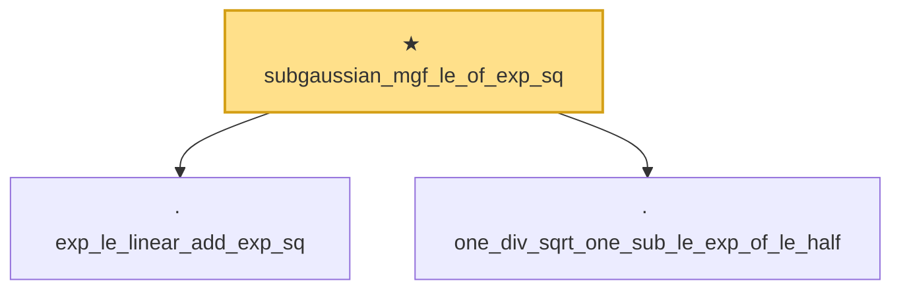

# Proof narrative — subgaussian_mgf_le_of_exp_sq

Root: **subgaussian_mgf_le_of_exp_sq** (theorem) `Statlib/StatFoundation/RandomVariable/SubGaussian/subgaussian_mgf_le_of_exp_sq.lean:91` · topic `StatFoundation`
Closure: 3 declarations across 1 files. Generated from `proof_graph.json` — no files were moved.

Reading order (foundations first, headline last):

  · `exp_le_linear_add_exp_sq` — private lemma · `Statlib/StatFoundation/RandomVariable/SubGaussian/subgaussian_mgf_le_of_exp_sq.lean:9`
  · `one_div_sqrt_one_sub_le_exp_of_le_half` — private lemma · `Statlib/StatFoundation/RandomVariable/SubGaussian/subgaussian_mgf_le_of_exp_sq.lean:45`
★ `subgaussian_mgf_le_of_exp_sq` — theorem · `Statlib/StatFoundation/RandomVariable/SubGaussian/subgaussian_mgf_le_of_exp_sq.lean:91` **← headline**

## Dependency diagram

