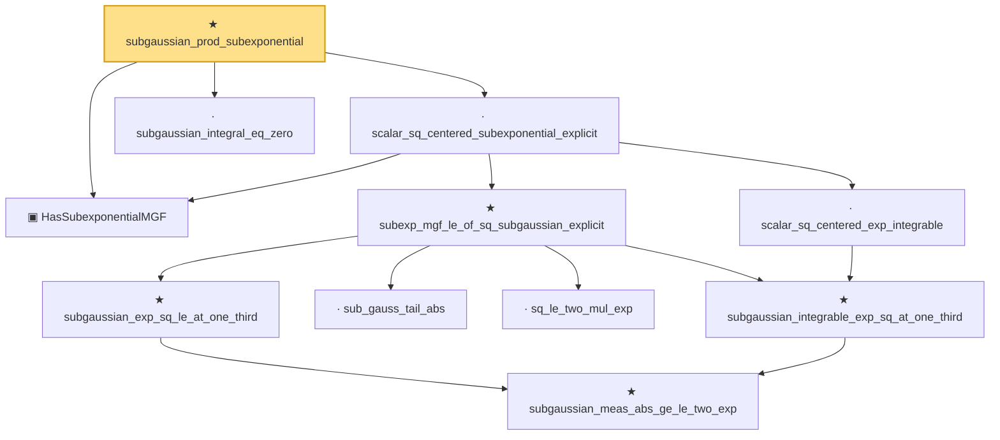

# Proof narrative — subgaussian_prod_subexponential

Root: **subgaussian_prod_subexponential** (theorem) `Statlib/StatFoundation/RandomVariable/SubExponential/subgaussian_prod_subexponential.lean:25` · topic `StatFoundation`
Closure: 11 declarations across 9 files. Generated from `proof_graph.json` — no files were moved.

Reading order (foundations first, headline last):

  ▣ `HasSubexponentialMGF` — structure · `Statlib/StatFoundation/Vocabulary/RandomVariable.lean:74`  _(also used by 29: coord_mul_subexponential_exists_of_indep, subexponential_mgf_const_mul_relaxed, coord_mul_scaled_subexponential_exists_of_indep, …)_
        ★ `subgaussian_meas_abs_ge_le_two_exp` — theorem · `Statlib/StatFoundation/RandomVariable/SubGaussian/subgaussian_meas_abs_ge_le_two_exp.lean:9`  _(also used by 3: subgaussian_linf_tail, lasso_noise_condition, subgaussian_even_moment_le)_
      ★ `subgaussian_integrable_exp_sq_at_one_third` — theorem · `Statlib/StatFoundation/RandomVariable/SubGaussian/subgaussian_exp_sq_le_at_one_third.lean:165`  _(also used by 4: coord_mul_subexponential_exists_of_indep, coord_sq_centered_scaled_exp_integrable, coord_sq_centered_subexponential_exists, …)_
    · `scalar_sq_centered_exp_integrable` — lemma · `Statlib/StatFoundation/RandomVariable/SubExponential/scalar_sq_centered_exp_integrable.lean:12`
      · `sub_gauss_tail_abs` — lemma · `Statlib/StatFoundation/RandomVariable/SubExponential/subexp_mgf_le_of_sq_subgaussian.lean:13`  _(also used by 1: sub_gauss_tail_sq)_
      · `sq_le_two_mul_exp` — lemma · `Statlib/StatFoundation/RandomVariable/SubGaussian/sq_le_two_mul_exp.lean:10`
      ★ `subgaussian_exp_sq_le_at_one_third` — theorem · `Statlib/StatFoundation/RandomVariable/SubGaussian/subgaussian_exp_sq_le_at_one_third.lean:14`
    ★ `subexp_mgf_le_of_sq_subgaussian_explicit` — theorem · `Statlib/StatFoundation/RandomVariable/SubExponential/subexp_mgf_le_of_sq_subgaussian.lean:72`  _(also used by 2: coord_sq_centered_mgf_bound_explicit, subexp_mgf_le_of_sq_subgaussian)_
  · `scalar_sq_centered_subexponential_explicit` — lemma · `Statlib/StatFoundation/RandomVariable/SubExponential/scalar_sq_centered_subexponential_explicit.lean:16`  _(also used by 3: sampleCovariance_concentration, jl_single_pair, subgaussian_rip_tail)_
  · `subgaussian_integral_eq_zero` — lemma · `Statlib/StatFoundation/RandomVariable/SubGaussian/subgaussian_integral_eq_zero.lean:12`  _(also used by 2: cov_trace_concentration, subgaussianVector_hasMean_zero)_
★ `subgaussian_prod_subexponential` — theorem · `Statlib/StatFoundation/RandomVariable/SubExponential/subgaussian_prod_subexponential.lean:25` **← headline**

## Dependency diagram

