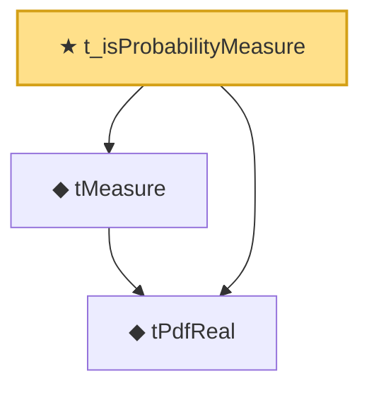

# Proof narrative — t_isProbabilityMeasure

Root: **t_isProbabilityMeasure** (theorem) `Statlib/StatFoundation/Probability/TDistribution.lean:40` · topic `StatFoundation`
Closure: 3 declarations across 1 files. Generated from `proof_graph.json` — no files were moved.

Reading order (foundations first, headline last):

  ◆ `tPdfReal` — noncomputable def · `Statlib/StatFoundation/Probability/TDistribution.lean:25`  _(also used by 4: two_sample_t_test, t_measure_eq_ratio, t_mean, …)_
  ◆ `tMeasure` — noncomputable def · `Statlib/StatFoundation/Probability/TDistribution.lean:31`  _(also used by 5: one_sample_t_test, two_sample_t_test, t_measure_eq_ratio, …)_
★ `t_isProbabilityMeasure` — theorem · `Statlib/StatFoundation/Probability/TDistribution.lean:40` **← headline**

## Dependency diagram

