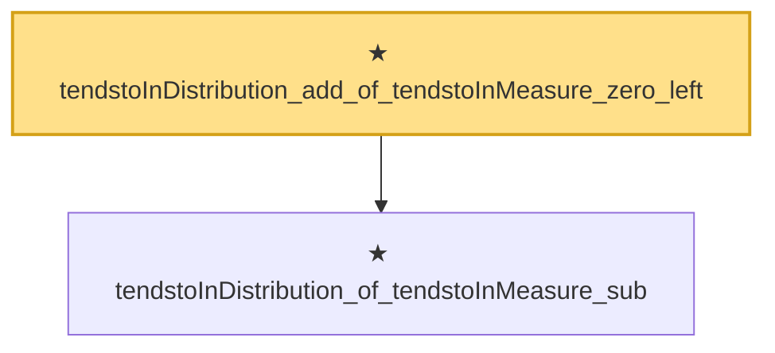

# Proof narrative — tendstoInDistribution_add_of_tendstoInMeasure_zero_left

Root: **tendstoInDistribution_add_of_tendstoInMeasure_zero_left** (theorem) `Statlib/StatFoundation/Convergence/AnalysisTools/ConvergenceModes.lean:454` · topic `StatFoundation`
Closure: 2 declarations across 1 files. Generated from `proof_graph.json` — no files were moved.

Reading order (foundations first, headline last):

  ★ `tendstoInDistribution_of_tendstoInMeasure_sub` — theorem · `Statlib/StatFoundation/Convergence/AnalysisTools/ConvergenceModes.lean:354`  _(also used by 12: tendstoInDistribution_debiasedLasso_scaledCenteredCoordinate_of_scoreCoordinate_and_l1_rowApprox_real, tendstoInDistribution_add_of_tendstoInMeasure_zero_right, tendstoInDistribution_sub_of_tendstoInMeasure_zero_right, …)_
★ `tendstoInDistribution_add_of_tendstoInMeasure_zero_left` — theorem · `Statlib/StatFoundation/Convergence/AnalysisTools/ConvergenceModes.lean:454` **← headline**

## Dependency diagram

