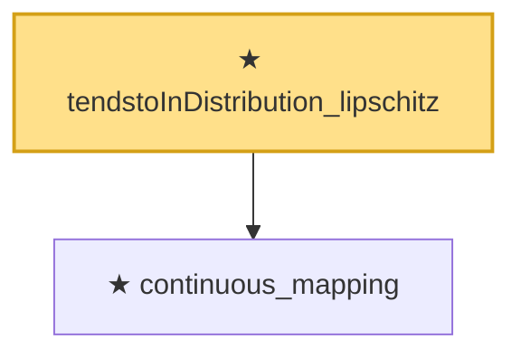

# Proof narrative — tendstoInDistribution_lipschitz

Root: **tendstoInDistribution_lipschitz** (theorem) `Statlib/StatFoundation/Convergence/AnalysisTools/MappingTheorems.lean:142` · topic `StatFoundation`
Closure: 2 declarations across 1 files. Generated from `proof_graph.json` — no files were moved.

Reading order (foundations first, headline last):

  ★ `continuous_mapping` — theorem · `Statlib/StatFoundation/Convergence/AnalysisTools/MappingTheorems.lean:131`  _(also used by 5: tendstoInDistribution_continuousLinearMap, tendstoInDistribution_norm, linear_combination_clt_to_finiteLinearCombination, …)_
★ `tendstoInDistribution_lipschitz` — theorem · `Statlib/StatFoundation/Convergence/AnalysisTools/MappingTheorems.lean:142` **← headline**

## Dependency diagram

