# Proof narrative — tendstoInDistribution_studentizedScaledCenteredCoordinate_of_coordinatewise_remainder_isBigOInProbability_real

Root: **tendstoInDistribution_studentizedScaledCenteredCoordinate_of_coordinatewise_remainder_isBigOInProbability_real** (theorem) `Statlib/StatFoundation/Convergence/AnalysisTools/AsymptoticLinear.lean:125` · topic `StatFoundation`
Closure: 46 declarations across 14 files. Generated from `proof_graph.json` — no files were moved.

Reading order (foundations first, headline last):

  ◆ `HasCoordinatewiseAEMeasurable` — abbrev · `Statlib/StatFoundation/Vocabulary/FiniteCoordinate.lean:33`  _(also used by 42: tendstoInDistribution_debiasedLasso_scaledCenteredFiniteCoordinate_of_linearScore_and_l1_rowApprox_real, tendstoInDistribution_studentizedDebiasedLasso_coordinate_of_linearScore_l1_rowApprox_and_se_real, tendstoInDistribution_debiasedLasso_scaledCenteredFiniteCoordinate_of_scoreVector_and_l1_rowApprox_real, …)_
  ◆ `scaledCenteredFiniteCoordinate` — abbrev · `Statlib/StatFoundation/Vocabulary/FiniteCoordinate.lean:76`  _(also used by 36: tendstoInDistribution_debiasedLasso_scaledCenteredFiniteCoordinate_of_linearScore_and_l1_rowApprox_real, tendstoInDistribution_studentizedDebiasedLasso_coordinate_of_linearScore_l1_rowApprox_and_se_real, tendstoInDistribution_debiasedLasso_scaledCenteredFiniteCoordinate_of_scoreVector_and_l1_rowApprox_real, …)_
  ◆ `HasCoordinatewiseAEMeasurableLimit` — abbrev · `Statlib/StatFoundation/Vocabulary/FiniteCoordinate.lean:38`  _(also used by 16: tendstoInDistribution_debiasedLasso_scaledCenteredFiniteCoordinate_of_linearScore_and_l1_rowApprox_real, tendstoInDistribution_studentizedDebiasedLasso_coordinate_of_linearScore_l1_rowApprox_and_se_real, tendstoInDistribution_debiasedLasso_scaledCenteredFiniteCoordinate_of_scoreVector_and_l1_rowApprox_real, …)_
    ◆ `finiteLinearCombination` — noncomputable abbrev · `Statlib/StatFoundation/Vocabulary/FiniteCoordinate.lean:29`  _(also used by 12: tendstoInDistribution_debiasedLasso_scaledCenteredFiniteCoordinate_of_linearScore_and_l1_rowApprox_real, hasFiniteLinearCombinationIsLittleOInProbability_of_coordinatewise_real, tendstoInDistribution_toLp_iff_finiteLinearCombination_real, …)_
  ◆ `HasFiniteLinearCombinationTendstoInDistribution` — abbrev · `Statlib/StatFoundation/Vocabulary/FiniteCoordinate.lean:43`  _(also used by 19: tendstoInDistribution_debiasedLasso_scaledCenteredFiniteCoordinate_of_linearScore_and_l1_rowApprox_real, tendstoInDistribution_studentizedDebiasedLasso_coordinate_of_linearScore_l1_rowApprox_and_se_real, tendstoInDistribution_debiasedLasso_scaledCenteredFiniteCoordinate_of_scoreVector_and_l1_rowApprox_real, …)_
    ◆ `IsBigOInProbability` — def · `Statlib/StatFoundation/Vocabulary/StochasticOrder.lean:48`  _(also used by 47: isBigOInProbability_smul_rate, isBigOInProbability_mul_rate, isBigOInProbability_continuousLinearMap, …)_
  ◆ `HasCoordinatewiseIsBigOInProbability` — abbrev · `Statlib/StatFoundation/Vocabulary/FiniteCoordinate.lean:82`
  ◆ `finiteCoordinateVector` — noncomputable abbrev · `Statlib/StatFoundation/Vocabulary/FiniteCoordinate.lean:25`  _(also used by 17: tendstoInDistribution_debiasedLasso_scaledCenteredFiniteCoordinate_of_linearScore_and_l1_rowApprox_real, tendstoInDistribution_debiasedLasso_scaledCenteredFiniteCoordinate_of_scoreVector_and_l1_rowApprox_real, tendstoInDistribution_studentizedDebiasedLasso_coordinate_of_scoreVector_l1_rowApprox_and_se_real, …)_
    ◆ `HasFiniteLinearCombinationIsBigOInProbability` — abbrev · `Statlib/StatFoundation/Vocabulary/FiniteCoordinate.lean:60`
        · `isBigOInProbability_zero` — lemma · `Statlib/StatFoundation/Convergence/AnalysisTools/StochasticOrder/Basic.lean:17`
        ★ `isBigOInProbability_add` — theorem · `Statlib/StatFoundation/Convergence/AnalysisTools/StochasticOrder/AlgebraAdd.lean:11`
      ★ `isBigOInProbability_finset_sum` — theorem · `Statlib/StatFoundation/Convergence/AnalysisTools/StochasticOrder/AlgebraFiniteSum.lean:12`
      ★ `isBigOInProbability_const_smul` — theorem · `Statlib/StatFoundation/Convergence/AnalysisTools/StochasticOrder/AlgebraMap.lean:15`
    ★ `hasFiniteLinearCombinationIsBigOInProbability_of_coordinatewise_real` — theorem · `Statlib/StatFoundation/Convergence/AnalysisTools/AsymptoticLinear.lean:26`
        ◆ `HasFiniteLinearCombinationTendstoInMeasureZero` — abbrev · `Statlib/StatFoundation/Vocabulary/FiniteCoordinate.lean:52`  _(also used by 6: tendstoInDistribution_debiasedLasso_scaledCenteredFiniteCoordinate_of_linearScore_and_l1_rowApprox_real, tendstoInDistribution_scaledCenteredFiniteCoordinate_of_remainder_tendstoInMeasure_real, mestimator_asymptotic_normal_of_linearization, …)_
            ★ `levy_forward` — theorem · `Statlib/StatFoundation/Convergence/AnalysisTools/LevyContinuity.lean:31`  _(also used by 1: charFun_eq_of_subseq)_
            · `charFun_map_innerSL` — lemma · `Statlib/StatFoundation/Convergence/AnalysisTools/CramerWold.lean:22`
            · `continuous_charFun` — lemma · `Statlib/StatFoundation/Convergence/AnalysisTools/CramerWold.lean:39`
            · `compl_Icc_eq_abs_gt` — lemma · `Statlib/StatFoundation/Convergence/AnalysisTools/LevyContinuity.lean:15`
            ★ `isTightMeasureSet_singleton` — theorem · `Statlib/StatFoundation/Convergence/AnalysisTools/Tightness.lean:113`  _(also used by 1: isTightMeasureSet_finiteRange)_
            ★ `isTight_finiteRange` — theorem · `Statlib/StatFoundation/Convergence/AnalysisTools/Tightness.lean:18`  _(also used by 1: isTightMeasureSet_range_map_of_isBigOInProbability_one_real)_
            ★ `isTight_of_charFun_tendsto` — theorem · `Statlib/StatFoundation/Convergence/AnalysisTools/LevyContinuity.lean:44`  _(also used by 1: levy_continuity)_
            · `isTight_of_charFun_tendsto_inner` — lemma · `Statlib/StatFoundation/Convergence/AnalysisTools/CramerWold.lean:131`
            ★ `levy_forward_inner` — theorem · `Statlib/StatFoundation/Convergence/AnalysisTools/CramerWold.lean:61`
            · `charFun_eq_of_subseq_inner` — lemma · `Statlib/StatFoundation/Convergence/AnalysisTools/CramerWold.lean:99`
            · `probMeasure_eq_of_charFun_eq_inner` — lemma · `Statlib/StatFoundation/Convergence/AnalysisTools/CramerWold.lean:114`
            ★ `cramer_wold_charFun` — theorem · `Statlib/StatFoundation/Convergence/AnalysisTools/CramerWold.lean:261`
            ★ `cramer_wold_reverse` — theorem · `Statlib/StatFoundation/Convergence/AnalysisTools/CramerWold.lean:297`  _(also used by 1: cramer_wold_iff)_
          ★ `tendstoInDistribution_of_forall_inner_real` — theorem · `Statlib/StatFoundation/Convergence/AnalysisTools/CramerWold.lean:348`  _(also used by 1: tendstoInDistribution_iff_forall_inner_real)_
        ★ `tendstoInDistribution_toLp_of_finiteLinearCombination_real` — theorem · `Statlib/StatFoundation/Convergence/AnalysisTools/CramerWold.lean:409`  _(also used by 4: tendstoInDistribution_toLp_iff_finiteLinearCombination_real, standardizedPartialSumVec_tendstoInDistribution, maxCoord_standardizedPartialSum_tendsto, …)_
        ★ `tendstoInMeasure_congr_left` — theorem · `Statlib/StatFoundation/Convergence/AnalysisTools/ConvergenceModes.lean:830`  _(also used by 7: inProbabilityConvergence_congr_left, tendstoInDistribution_add_of_isBigOInProbability_tendsto_zero_left, tendstoInDistribution_add_of_isBigOInProbability_tendsto_zero_right, …)_
        ★ `tendstoInDistribution_of_tendstoInMeasure_sub` — theorem · `Statlib/StatFoundation/Convergence/AnalysisTools/ConvergenceModes.lean:354`  _(also used by 12: tendstoInDistribution_debiasedLasso_scaledCenteredCoordinate_of_scoreCoordinate_and_l1_rowApprox_real, tendstoInDistribution_add_of_tendstoInMeasure_zero_left, tendstoInDistribution_add_of_tendstoInMeasure_zero_right, …)_
      ★ `tendstoInDistribution_toLp_of_finiteLinearCombination_remainder_tendstoInMeasure_real` — theorem · `Statlib/StatFoundation/Convergence/AnalysisTools/CramerWold.lean:454`  _(also used by 2: tendstoInDistribution_scaledCenteredFiniteCoordinate_of_remainder_tendstoInMeasure_real, tendstoInDistribution_toLp_of_finiteLinearCombination_remainder_isLittleOInProbability_real)_
          ◆ `IsLittleOInProbability` — def · `Statlib/StatFoundation/Vocabulary/StochasticOrder.lean:58`  _(also used by 48: isLittleOInProbability_add, isLittleOInProbability_smul_rate, isLittleOInProbability_mul_rate, …)_
          ★ `tendstoInMeasure_iff_norm` — theorem · `Statlib/StatFoundation/Convergence/AnalysisTools/ConvergenceModes.lean:584`  _(also used by 1: z_estimator_linearization_from_mvt)_
        ★ `isLittleOInProbability_one_iff_tendstoInMeasure_zero` — theorem · `Statlib/StatFoundation/Convergence/AnalysisTools/StochasticOrder/Basic.lean:201`  _(also used by 5: tendstoInDistribution_debiasedLasso_scaledCenteredFiniteCoordinate_of_linearScore_and_l1_rowApprox_real, tendstoInDistribution_debiasedLasso_scaledCenteredCoordinate_of_scoreCoordinate_and_l1_rowApprox_real, isLittleOInProbability_implies_inProbabilityConvergence_zero, …)_
          ★ `isLittleOInProbability_of_isBigOInProbability_of_rate_isLittleO` — theorem · `Statlib/StatFoundation/Convergence/AnalysisTools/StochasticOrder/RateRefinement.lean:15`
        ★ `isLittleOInProbability_one_of_isBigOInProbability_tendsto_zero` — theorem · `Statlib/StatFoundation/Convergence/AnalysisTools/StochasticOrder/RateRefinement.lean:62`  _(also used by 3: hasCoordinatewiseIsLittleOInProbability_debiasedLasso_scaledBiasRemainder_of_l1Error_and_rowApproxError_real, inProbabilityConvergence_zero_of_isBigOInProbability_tendsto_zero, isBoundedInProbability_of_isBigOInProbability_tendsto_zero)_
      ★ `tendstoInMeasure_zero_of_isBigOInProbability_tendsto_zero` — theorem · `Statlib/StatFoundation/Convergence/AnalysisTools/StochasticOrder/ConvergenceBridges.lean:404`  _(also used by 5: tendstoInDistribution_zero_of_isBigOInProbability_tendsto_zero, tendstoInDistribution_add_of_isBigOInProbability_tendsto_zero_left, tendstoInDistribution_add_of_isBigOInProbability_tendsto_zero_right, …)_
    ★ `tendstoInDistribution_toLp_of_finiteLinearCombination_remainder_isBigOInProbability_real` — theorem · `Statlib/StatFoundation/Convergence/AnalysisTools/CramerWold.lean:487`
  ★ `tendstoInDistribution_scaledCenteredFiniteCoordinate_of_coordinatewise_remainder_isBigOInProbability_real` — theorem · `Statlib/StatFoundation/Convergence/AnalysisTools/AsymptoticLinear.lean:76`
    ★ `slutsky_mul` — theorem · `Statlib/StatFoundation/Convergence/AnalysisTools/MappingTheorems.lean:40`  _(also used by 1: z_estimator_asymptotic_normal_of_linearization)_
      ★ `tendstoInMeasure_iff_dist` — theorem · `Statlib/StatFoundation/Convergence/AnalysisTools/ConvergenceModes.lean:574`  _(also used by 5: tendstoInMeasure_of_inProbabilityConvergence, tendstoInMeasure_lipschitz, tendstoInMeasure_const_of_rescaled_tendstoInDistribution, …)_
    ★ `tendstoInMeasure_inv_of_ne_zero` — theorem · `Statlib/StatFoundation/Convergence/AnalysisTools/MappingTheorems.lean:61`  _(also used by 1: z_estimator_linearization_from_mvt)_
  ★ `slutsky_div` — theorem · `Statlib/StatFoundation/Convergence/AnalysisTools/MappingTheorems.lean:108`  _(also used by 1: tendstoInDistribution_studentizedScaledCenteredCoordinate_of_coordinatewise_remainder_isLittleOInProbability_real)_
★ `tendstoInDistribution_studentizedScaledCenteredCoordinate_of_coordinatewise_remainder_isBigOInProbability_real` — theorem · `Statlib/StatFoundation/Convergence/AnalysisTools/AsymptoticLinear.lean:125` **← headline**

## Dependency diagram

```mermaid
flowchart TD
  n0["◆ HasCoordinatewiseAEMeasurable"]
  n1["◆ scaledCenteredFiniteCoordinate"]
  n2["◆ HasCoordinatewiseAEMeasurableLimit"]
  n3["◆ finiteLinearCombination"]
  n4["◆ HasFiniteLinearCombinationTendstoInDistribution"]
  n5["◆ IsBigOInProbability"]
  n6["◆ HasCoordinatewiseIsBigOInProbability"]
  n7["◆ finiteCoordinateVector"]
  n8["◆ HasFiniteLinearCombinationIsBigOInProbability"]
  n9["· isBigOInProbability_zero"]
  n10["★ isBigOInProbability_add"]
  n11["★ isBigOInProbability_finset_sum"]
  n12["★ isBigOInProbability_const_smul"]
  n13["★ hasFiniteLinearCombinationIsBigOInProbability_of_coordinatewise_real"]
  n14["◆ HasFiniteLinearCombinationTendstoInMeasureZero"]
  n15["★ levy_forward"]
  n16["· charFun_map_innerSL"]
  n17["· continuous_charFun"]
  n18["· compl_Icc_eq_abs_gt"]
  n19["★ isTightMeasureSet_singleton"]
  n20["★ isTight_finiteRange"]
  n21["★ isTight_of_charFun_tendsto"]
  n22["· isTight_of_charFun_tendsto_inner"]
  n23["★ levy_forward_inner"]
  n24["· charFun_eq_of_subseq_inner"]
  n25["· probMeasure_eq_of_charFun_eq_inner"]
  n26["★ cramer_wold_charFun"]
  n27["★ cramer_wold_reverse"]
  n28["★ tendstoInDistribution_of_forall_inner_real"]
  n29["★ tendstoInDistribution_toLp_of_finiteLinearCombination_real"]
  n30["★ tendstoInMeasure_congr_left"]
  n31["★ tendstoInDistribution_of_tendstoInMeasure_sub"]
  n32["★ tendstoInDistribution_toLp_of_finiteLinearCombination_remainder_tendstoInMeasure_real"]
  n33["◆ IsLittleOInProbability"]
  n34["★ tendstoInMeasure_iff_norm"]
  n35["★ isLittleOInProbability_one_iff_tendstoInMeasure_zero"]
  n36["★ isLittleOInProbability_of_isBigOInProbability_of_rate_isLittleO"]
  n37["★ isLittleOInProbability_one_of_isBigOInProbability_tendsto_zero"]
  n38["★ tendstoInMeasure_zero_of_isBigOInProbability_tendsto_zero"]
  n39["★ tendstoInDistribution_toLp_of_finiteLinearCombination_remainder_isBigOInProbability_real"]
  n40["★ tendstoInDistribution_scaledCenteredFiniteCoordinate_of_coordinatewise_remainder_isBigOInProbability_real"]
  n41["★ slutsky_mul"]
  n42["★ tendstoInMeasure_iff_dist"]
  n43["★ tendstoInMeasure_inv_of_ne_zero"]
  n44["★ slutsky_div"]
  n45["★ tendstoInDistribution_studentizedScaledCenteredCoordinate_of_coordinatewise_remainder_isBigOInProbability_real"]
  n4 --> n3
  n6 --> n5
  n8 --> n5
  n8 --> n3
  n9 --> n5
  n10 --> n5
  n11 --> n5
  n11 --> n9
  n11 --> n10
  n12 --> n5
  n13 --> n6
  n13 --> n8
  n13 --> n3
  n13 --> n11
  n13 --> n12
  n14 --> n3
  n20 --> n19
  n21 --> n18
  n21 --> n20
  n22 --> n21
  n22 --> n16
  n24 --> n23
  n26 --> n22
  n26 --> n24
  n26 --> n25
  n27 --> n15
  n27 --> n16
  n27 --> n17
  n27 --> n26
  n27 --> n25
  n28 --> n27
  n29 --> n0
  n29 --> n2
  n29 --> n4
  n29 --> n7
  n29 --> n28
  n29 --> n3
  n32 --> n0
  n32 --> n2
  n32 --> n4
  n32 --> n14
  n32 --> n7
  n32 --> n29
  n32 --> n3
  n32 --> n30
  n32 --> n31
  n35 --> n33
  n35 --> n34
  n36 --> n5
  n36 --> n33
  n37 --> n5
  n37 --> n33
  n37 --> n36
  n38 --> n5
  n38 --> n35
  n38 --> n37
  n39 --> n0
  n39 --> n2
  n39 --> n4
  n39 --> n8
  n39 --> n7
  n39 --> n32
  n39 --> n38
  n39 --> n3
  n40 --> n0
  n40 --> n1
  n40 --> n2
  n40 --> n4
  n40 --> n6
  n40 --> n7
  n40 --> n8
  n40 --> n13
  n40 --> n39
  n43 --> n42
  n44 --> n41
  n44 --> n43
  n45 --> n0
  n45 --> n1
  n45 --> n2
  n45 --> n4
  n45 --> n6
  n45 --> n7
  n45 --> n40
  n45 --> n44
  class n45 headline;
  classDef headline fill:#ffe08a,stroke:#d4a017,stroke-width:2px;
  classDef axiomNode fill:#ffd0d0,stroke:#c0392b,stroke-dasharray:4 2;
```

