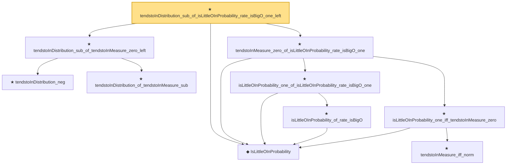

# Proof narrative — tendstoInDistribution_sub_of_isLittleOInProbability_rate_isBigO_one_left

Root: **tendstoInDistribution_sub_of_isLittleOInProbability_rate_isBigO_one_left** (theorem) `Statlib/StatFoundation/Convergence/AnalysisTools/StochasticOrder/ConvergenceBridges.lean:789` · topic `StatFoundation`
Closure: 10 declarations across 5 files. Generated from `proof_graph.json` — no files were moved.

Reading order (foundations first, headline last):

  ◆ `IsLittleOInProbability` — def · `Statlib/StatFoundation/Vocabulary/StochasticOrder.lean:58`  _(also used by 46: isLittleOInProbability_add, isLittleOInProbability_smul_rate, isLittleOInProbability_mul_rate, …)_
    ★ `tendstoInDistribution_neg` — theorem · `Statlib/StatFoundation/Convergence/AnalysisTools/ConvergenceModes.lean:442`
    ★ `tendstoInDistribution_of_tendstoInMeasure_sub` — theorem · `Statlib/StatFoundation/Convergence/AnalysisTools/ConvergenceModes.lean:354`  _(also used by 12: tendstoInDistribution_debiasedLasso_scaledCenteredCoordinate_of_scoreCoordinate_and_l1_rowApprox_real, tendstoInDistribution_add_of_tendstoInMeasure_zero_left, tendstoInDistribution_add_of_tendstoInMeasure_zero_right, …)_
  ★ `tendstoInDistribution_sub_of_tendstoInMeasure_zero_left` — theorem · `Statlib/StatFoundation/Convergence/AnalysisTools/ConvergenceModes.lean:524`  _(also used by 1: tendstoInDistribution_sub_of_isBigOInProbability_tendsto_zero_left)_
      ★ `tendstoInMeasure_iff_norm` — theorem · `Statlib/StatFoundation/Convergence/AnalysisTools/ConvergenceModes.lean:584`  _(also used by 1: z_estimator_linearization_from_mvt)_
    ★ `isLittleOInProbability_one_iff_tendstoInMeasure_zero` — theorem · `Statlib/StatFoundation/Convergence/AnalysisTools/StochasticOrder/Basic.lean:201`  _(also used by 5: tendstoInDistribution_debiasedLasso_scaledCenteredFiniteCoordinate_of_linearScore_and_l1_rowApprox_real, tendstoInDistribution_debiasedLasso_scaledCenteredCoordinate_of_scoreCoordinate_and_l1_rowApprox_real, isLittleOInProbability_implies_inProbabilityConvergence_zero, …)_
      ★ `isLittleOInProbability_of_rate_isBigO` — theorem · `Statlib/StatFoundation/Convergence/AnalysisTools/StochasticOrder/RateLittle.lean:12`
    ★ `isLittleOInProbability_one_of_isLittleOInProbability_rate_isBigO_one` — theorem · `Statlib/StatFoundation/Convergence/AnalysisTools/StochasticOrder/ConvergenceBridges.lean:525`  _(also used by 2: inProbabilityConvergence_zero_of_isLittleOInProbability_rate_isBigO_one, isBoundedInProbability_of_isLittleOInProbability_rate_isBigO_one)_
  ★ `tendstoInMeasure_zero_of_isLittleOInProbability_rate_isBigO_one` — theorem · `Statlib/StatFoundation/Convergence/AnalysisTools/StochasticOrder/ConvergenceBridges.lean:535`  _(also used by 5: tendstoInDistribution_toLp_of_finiteLinearCombination_remainder_isLittleOInProbability_real, tendstoInDistribution_zero_of_isLittleOInProbability_rate_isBigO_one, tendstoInDistribution_add_of_isLittleOInProbability_rate_isBigO_one_left, …)_
★ `tendstoInDistribution_sub_of_isLittleOInProbability_rate_isBigO_one_left` — theorem · `Statlib/StatFoundation/Convergence/AnalysisTools/StochasticOrder/ConvergenceBridges.lean:789` **← headline**

## Dependency diagram

