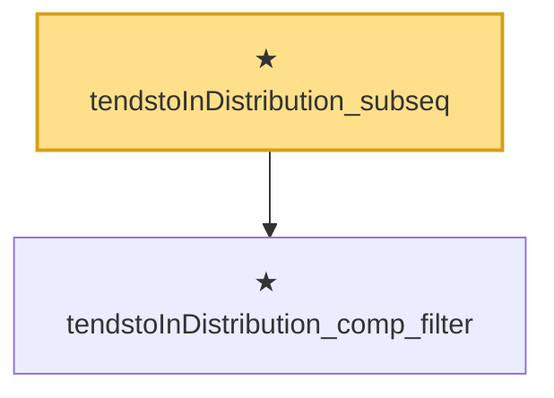

# Proof narrative — tendstoInDistribution_subseq

Root: **tendstoInDistribution_subseq** (theorem) `Statlib/StatFoundation/Convergence/AnalysisTools/ConvergenceModes.lean:248` · topic `StatFoundation`
Closure: 2 declarations across 1 files. Generated from `proof_graph.json` — no files were moved.

Reading order (foundations first, headline last):

  ★ `tendstoInDistribution_comp_filter` — theorem · `Statlib/StatFoundation/Convergence/AnalysisTools/ConvergenceModes.lean:236`
★ `tendstoInDistribution_subseq` — theorem · `Statlib/StatFoundation/Convergence/AnalysisTools/ConvergenceModes.lean:248` **← headline**

## Dependency diagram

