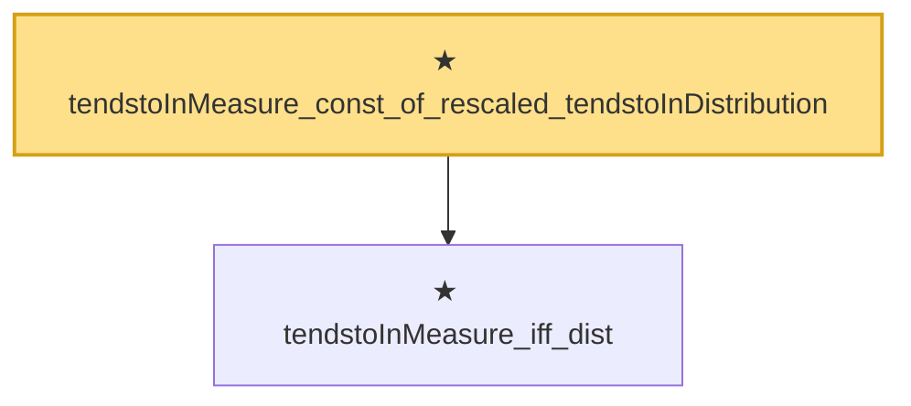

# Proof narrative — tendstoInMeasure_const_of_rescaled_tendstoInDistribution

Root: **tendstoInMeasure_const_of_rescaled_tendstoInDistribution** (theorem) `Statlib/StatFoundation/Convergence/AnalysisTools/MappingTheorems.lean:189` · topic `StatFoundation`
Closure: 2 declarations across 2 files. Generated from `proof_graph.json` — no files were moved.

Reading order (foundations first, headline last):

  ★ `tendstoInMeasure_iff_dist` — theorem · `Statlib/StatFoundation/Convergence/AnalysisTools/ConvergenceModes.lean:574`  _(also used by 5: tendstoInMeasure_of_inProbabilityConvergence, tendstoInMeasure_lipschitz, tendstoInMeasure_inv_of_ne_zero, …)_
★ `tendstoInMeasure_const_of_rescaled_tendstoInDistribution` — theorem · `Statlib/StatFoundation/Convergence/AnalysisTools/MappingTheorems.lean:189` **← headline**

## Dependency diagram

