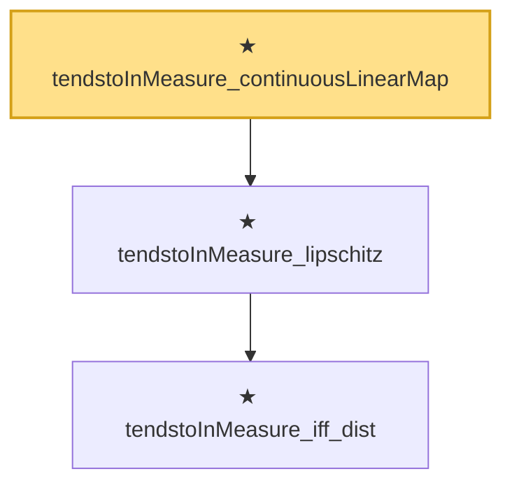

# Proof narrative — tendstoInMeasure_continuousLinearMap

Root: **tendstoInMeasure_continuousLinearMap** (theorem) `Statlib/StatFoundation/Convergence/AnalysisTools/ConvergenceModes.lean:783` · topic `StatFoundation`
Closure: 3 declarations across 1 files. Generated from `proof_graph.json` — no files were moved.

Reading order (foundations first, headline last):

    ★ `tendstoInMeasure_iff_dist` — theorem · `Statlib/StatFoundation/Convergence/AnalysisTools/ConvergenceModes.lean:574`  _(also used by 5: tendstoInMeasure_of_inProbabilityConvergence, tendstoInMeasure_inv_of_ne_zero, tendstoInMeasure_const_of_rescaled_tendstoInDistribution, …)_
  ★ `tendstoInMeasure_lipschitz` — theorem · `Statlib/StatFoundation/Convergence/AnalysisTools/ConvergenceModes.lean:746`  _(also used by 1: tendstoInMeasure_norm)_
★ `tendstoInMeasure_continuousLinearMap` — theorem · `Statlib/StatFoundation/Convergence/AnalysisTools/ConvergenceModes.lean:783` **← headline**

## Dependency diagram

