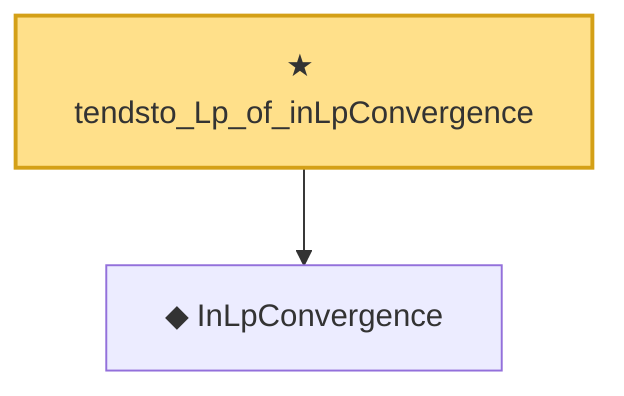

# Proof narrative — tendsto_Lp_of_inLpConvergence

Root: **tendsto_Lp_of_inLpConvergence** (theorem) `Statlib/StatFoundation/Convergence/AnalysisTools/ConvergenceModes.lean:1037` · topic `StatFoundation`
Closure: 2 declarations across 1 files. Generated from `proof_graph.json` — no files were moved.

Reading order (foundations first, headline last):

  ◆ `InLpConvergence` — def · `Statlib/StatFoundation/Convergence/AnalysisTools/ConvergenceModes.lean:77`  _(also used by 68: inLpConvergence_congr_left, inLpConvergence_congr_right, inLpConvergence_congr, …)_
★ `tendsto_Lp_of_inLpConvergence` — theorem · `Statlib/StatFoundation/Convergence/AnalysisTools/ConvergenceModes.lean:1037` **← headline**

## Dependency diagram

