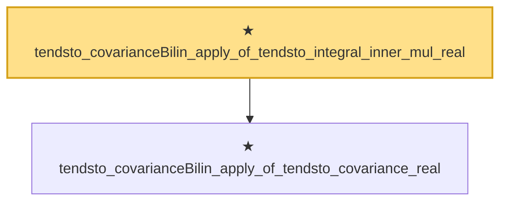

# Proof narrative — tendsto_covarianceBilin_apply_of_tendsto_integral_inner_mul_real

Root: **tendsto_covarianceBilin_apply_of_tendsto_integral_inner_mul_real** (theorem) `Statlib/StatFoundation/Convergence/AnalysisTools/IntegralConvergence.lean:1455` · topic `StatFoundation`
Closure: 2 declarations across 1 files. Generated from `proof_graph.json` — no files were moved.

Reading order (foundations first, headline last):

  ★ `tendsto_covarianceBilin_apply_of_tendsto_covariance_real` — theorem · `Statlib/StatFoundation/Convergence/AnalysisTools/IntegralConvergence.lean:1429`
★ `tendsto_covarianceBilin_apply_of_tendsto_integral_inner_mul_real` — theorem · `Statlib/StatFoundation/Convergence/AnalysisTools/IntegralConvergence.lean:1455` **← headline**

## Dependency diagram

