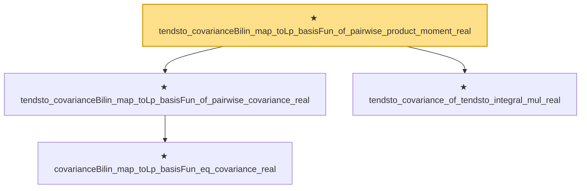

# Proof narrative — tendsto_covarianceBilin_map_toLp_basisFun_of_pairwise_product_moment_real

Root: **tendsto_covarianceBilin_map_toLp_basisFun_of_pairwise_product_moment_real** (theorem) `Statlib/StatFoundation/Convergence/AnalysisTools/IntegralConvergence.lean:1333` · topic `StatFoundation`
Closure: 4 declarations across 1 files. Generated from `proof_graph.json` — no files were moved.

Reading order (foundations first, headline last):

    ★ `covarianceBilin_map_toLp_basisFun_eq_covariance_real` — theorem · `Statlib/StatFoundation/Convergence/AnalysisTools/IntegralConvergence.lean:1201`
  ★ `tendsto_covarianceBilin_map_toLp_basisFun_of_pairwise_covariance_real` — theorem · `Statlib/StatFoundation/Convergence/AnalysisTools/IntegralConvergence.lean:1238`  _(also used by 1: tendsto_covarianceBilin_map_toLp_basisFun_of_forall_inLpConvergence_two_real)_
  ★ `tendsto_covariance_of_tendsto_integral_mul_real` — theorem · `Statlib/StatFoundation/Convergence/AnalysisTools/IntegralConvergence.lean:371`  _(also used by 7: tendsto_cross_covariance_matrix_of_pairwise_product_moment_real, tendsto_covariance_matrix_toEuclideanCLM_of_pairwise_product_moment_real, tendsto_norm_sub_covariance_matrix_toEuclideanCLM_zero_of_pairwise_product_moment_real, …)_
★ `tendsto_covarianceBilin_map_toLp_basisFun_of_pairwise_product_moment_real` — theorem · `Statlib/StatFoundation/Convergence/AnalysisTools/IntegralConvergence.lean:1333` **← headline**

## Dependency diagram

