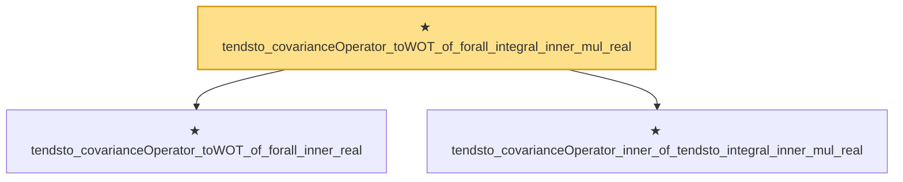

# Proof narrative — tendsto_covarianceOperator_toWOT_of_forall_integral_inner_mul_real

Root: **tendsto_covarianceOperator_toWOT_of_forall_integral_inner_mul_real** (theorem) `Statlib/StatFoundation/Convergence/AnalysisTools/IntegralConvergence.lean:1610` · topic `StatFoundation`
Closure: 3 declarations across 1 files. Generated from `proof_graph.json` — no files were moved.

Reading order (foundations first, headline last):

  ★ `tendsto_covarianceOperator_toWOT_of_forall_inner_real` — theorem · `Statlib/StatFoundation/Convergence/AnalysisTools/IntegralConvergence.lean:1566`  _(also used by 1: tendsto_covarianceOperator_map_toLp_toWOT_of_pairwise_integral_mul_real)_
  ★ `tendsto_covarianceOperator_inner_of_tendsto_integral_inner_mul_real` — theorem · `Statlib/StatFoundation/Convergence/AnalysisTools/IntegralConvergence.lean:1540`
★ `tendsto_covarianceOperator_toWOT_of_forall_integral_inner_mul_real` — theorem · `Statlib/StatFoundation/Convergence/AnalysisTools/IntegralConvergence.lean:1610` **← headline**

## Dependency diagram

