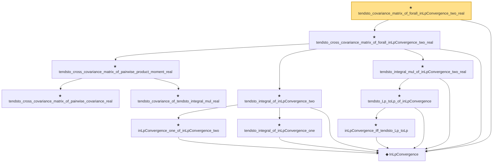

# Proof narrative — tendsto_covariance_matrix_of_forall_inLpConvergence_two_real

Root: **tendsto_covariance_matrix_of_forall_inLpConvergence_two_real** (theorem) `Statlib/StatFoundation/Convergence/AnalysisTools/IntegralConvergence.lean:2303` · topic `StatFoundation`
Closure: 12 declarations across 2 files. Generated from `proof_graph.json` — no files were moved.

Reading order (foundations first, headline last):

  ◆ `InLpConvergence` — def · `Statlib/StatFoundation/Convergence/AnalysisTools/ConvergenceModes.lean:77`  _(also used by 61: inLpConvergence_congr_left, inLpConvergence_congr_right, inLpConvergence_congr, …)_
      ★ `tendsto_cross_covariance_matrix_of_pairwise_covariance_real` — theorem · `Statlib/StatFoundation/Convergence/AnalysisTools/IntegralConvergence.lean:628`  _(also used by 2: tendsto_covariance_matrix_of_pairwise_covariance_real, tendsto_cross_covariance_matrix_of_forall_inProbabilityConvergence_of_isUniformIntegrableInLp_two_real)_
      ★ `tendsto_covariance_of_tendsto_integral_mul_real` — theorem · `Statlib/StatFoundation/Convergence/AnalysisTools/IntegralConvergence.lean:371`  _(also used by 7: tendsto_covariance_matrix_toEuclideanCLM_of_pairwise_product_moment_real, tendsto_norm_sub_covariance_matrix_toEuclideanCLM_zero_of_pairwise_product_moment_real, tendsto_norm_covariance_matrix_toEuclideanCLM_of_pairwise_product_moment_real, …)_
    ★ `tendsto_cross_covariance_matrix_of_pairwise_product_moment_real` — theorem · `Statlib/StatFoundation/Convergence/AnalysisTools/IntegralConvergence.lean:709`  _(also used by 1: tendsto_covariance_matrix_of_pairwise_product_moment_real)_
      ★ `inLpConvergence_one_of_inLpConvergence_two` — theorem · `Statlib/StatFoundation/Convergence/AnalysisTools/IntegralConvergence.lean:2171`
      ★ `tendsto_integral_of_inLpConvergence_one` — theorem · `Statlib/StatFoundation/Convergence/AnalysisTools/IntegralConvergence.lean:23`  _(also used by 4: tendsto_integral_sub_zero_of_inLpConvergence_one, tendsto_integral_of_inProbabilityConvergence_of_isUniformIntegrable, tendsto_integral_continuousLinearMap_of_inLpConvergence_one, …)_
    ★ `tendsto_integral_of_inLpConvergence_two` — theorem · `Statlib/StatFoundation/Convergence/AnalysisTools/IntegralConvergence.lean:2188`  _(also used by 2: tendsto_covariance_of_inLpConvergence_two_real, tendsto_integral_of_inProbabilityConvergence_of_isUniformIntegrableInLp_two)_
        ★ `inLpConvergence_iff_tendsto_Lp_toLp` — theorem · `Statlib/StatFoundation/Convergence/AnalysisTools/ConvergenceModes.lean:1046`  _(also used by 1: inLpConvergence_of_tendsto_Lp_toLp)_
      ★ `tendsto_Lp_toLp_of_inLpConvergence` — theorem · `Statlib/StatFoundation/Convergence/AnalysisTools/ConvergenceModes.lean:1059`
    ★ `tendsto_integral_mul_of_inLpConvergence_two_real` — theorem · `Statlib/StatFoundation/Convergence/AnalysisTools/IntegralConvergence.lean:1941`  _(also used by 4: tendsto_integral_sq_of_inLpConvergence_two_real, tendsto_pairwise_integral_mul_of_forall_inLpConvergence_two_real, tendsto_covariance_of_inLpConvergence_two_real, …)_
  ★ `tendsto_cross_covariance_matrix_of_forall_inLpConvergence_two_real` — theorem · `Statlib/StatFoundation/Convergence/AnalysisTools/IntegralConvergence.lean:2270`
★ `tendsto_covariance_matrix_of_forall_inLpConvergence_two_real` — theorem · `Statlib/StatFoundation/Convergence/AnalysisTools/IntegralConvergence.lean:2303` **← headline**

## Dependency diagram

