# Proof narrative — tendsto_covariance_matrix_of_forall_inProbabilityConvergence_of_isUniformIntegrableInLp_two_real

Root: **tendsto_covariance_matrix_of_forall_inProbabilityConvergence_of_isUniformIntegrableInLp_two_real** (theorem) `Statlib/StatFoundation/Convergence/AnalysisTools/IntegralConvergence.lean:2818` · topic `StatFoundation`
Closure: 26 declarations across 4 files. Generated from `proof_graph.json` — no files were moved.

Reading order (foundations first, headline last):

  ◆ `IsUniformIntegrableInLp` — abbrev · `Statlib/StatFoundation/Vocabulary/UniformIntegrability.lean:53`  _(also used by 33: tendsto_integral_of_inProbabilityConvergence_of_isUniformIntegrableInLp_two, tendsto_integral_mul_of_inProbabilityConvergence_of_isUniformIntegrableInLp_two_real, tendsto_pairwise_integral_mul_of_forall_inProbabilityConvergence_of_isUniformIntegrableInLp_two_real, …)_
    ◆ `InProbabilityTailEvent` — def · `Statlib/StatFoundation/Convergence/AnalysisTools/ConvergenceModes.lean:46`  _(also used by 10: t_test_consistent, CompleteConvergence, inProbabilityConvergence_of_tendstoInMeasure, …)_
  ◆ `InProbabilityConvergence` — def · `Statlib/StatFoundation/Convergence/AnalysisTools/ConvergenceModes.lean:61`  _(also used by 69: t_test_consistent, inProbabilityConvergence_of_tendstoInMeasure, inProbabilityConvergence_iff_tendstoInMeasure, …)_
    ★ `tendsto_cross_covariance_matrix_of_pairwise_covariance_real` — theorem · `Statlib/StatFoundation/Convergence/AnalysisTools/IntegralConvergence.lean:628`  _(also used by 2: tendsto_cross_covariance_matrix_of_pairwise_product_moment_real, tendsto_cross_covariance_matrix_of_forall_inProbabilityConvergence_of_isUniformIntegrableInLp_two_real)_
  ★ `tendsto_covariance_matrix_of_pairwise_covariance_real` — theorem · `Statlib/StatFoundation/Convergence/AnalysisTools/IntegralConvergence.lean:657`
        ◆ `InLpConvergence` — def · `Statlib/StatFoundation/Convergence/AnalysisTools/ConvergenceModes.lean:77`  _(also used by 59: inLpConvergence_congr_left, inLpConvergence_congr_right, inLpConvergence_congr, …)_
        ★ `tendsto_covariance_of_tendsto_integral_mul_real` — theorem · `Statlib/StatFoundation/Convergence/AnalysisTools/IntegralConvergence.lean:371`  _(also used by 7: tendsto_cross_covariance_matrix_of_pairwise_product_moment_real, tendsto_covariance_matrix_toEuclideanCLM_of_pairwise_product_moment_real, tendsto_norm_sub_covariance_matrix_toEuclideanCLM_zero_of_pairwise_product_moment_real, …)_
          ★ `inLpConvergence_one_of_inLpConvergence_two` — theorem · `Statlib/StatFoundation/Convergence/AnalysisTools/IntegralConvergence.lean:2171`
          ★ `tendsto_integral_of_inLpConvergence_one` — theorem · `Statlib/StatFoundation/Convergence/AnalysisTools/IntegralConvergence.lean:23`  _(also used by 4: tendsto_integral_sub_zero_of_inLpConvergence_one, tendsto_integral_of_inProbabilityConvergence_of_isUniformIntegrable, tendsto_integral_continuousLinearMap_of_inLpConvergence_one, …)_
        ★ `tendsto_integral_of_inLpConvergence_two` — theorem · `Statlib/StatFoundation/Convergence/AnalysisTools/IntegralConvergence.lean:2188`  _(also used by 2: tendsto_cross_covariance_matrix_of_forall_inLpConvergence_two_real, tendsto_integral_of_inProbabilityConvergence_of_isUniformIntegrableInLp_two)_
            ★ `inLpConvergence_iff_tendsto_Lp_toLp` — theorem · `Statlib/StatFoundation/Convergence/AnalysisTools/ConvergenceModes.lean:1046`  _(also used by 1: inLpConvergence_of_tendsto_Lp_toLp)_
          ★ `tendsto_Lp_toLp_of_inLpConvergence` — theorem · `Statlib/StatFoundation/Convergence/AnalysisTools/ConvergenceModes.lean:1059`
        ★ `tendsto_integral_mul_of_inLpConvergence_two_real` — theorem · `Statlib/StatFoundation/Convergence/AnalysisTools/IntegralConvergence.lean:1941`  _(also used by 4: tendsto_integral_sq_of_inLpConvergence_two_real, tendsto_pairwise_integral_mul_of_forall_inLpConvergence_two_real, tendsto_cross_covariance_matrix_of_forall_inLpConvergence_two_real, …)_
      ★ `tendsto_covariance_of_inLpConvergence_two_real` — theorem · `Statlib/StatFoundation/Convergence/AnalysisTools/IntegralConvergence.lean:2206`  _(also used by 2: tendsto_pairwise_covariance_of_forall_inLpConvergence_two_real, tendsto_pairwise_cross_covariance_of_forall_inLpConvergence_two_real)_
        ★ `memLp_of_tendstoInMeasure_of_isUniformIntegrableInLp` — theorem · `Statlib/StatFoundation/Convergence/AnalysisTools/UniformIntegrability.lean:214`
          ★ `tendstoInMeasure_iff_dist` — theorem · `Statlib/StatFoundation/Convergence/AnalysisTools/ConvergenceModes.lean:574`  _(also used by 5: tendstoInMeasure_lipschitz, tendstoInMeasure_inv_of_ne_zero, tendstoInMeasure_const_of_rescaled_tendstoInDistribution, …)_
        ★ `tendstoInMeasure_of_inProbabilityConvergence` — theorem · `Statlib/StatFoundation/Convergence/AnalysisTools/ConvergenceModes.lean:696`  _(also used by 9: inProbabilityConvergence_iff_tendstoInMeasure, inProbabilityConvergence_subseq, inProbabilityConvergence_congr_left, …)_
      ★ `memLp_two_of_inProbabilityConvergence_of_isUniformIntegrableInLp_two` — theorem · `Statlib/StatFoundation/Convergence/AnalysisTools/IntegralConvergence.lean:2458`  _(also used by 13: tendsto_integral_of_inProbabilityConvergence_of_isUniformIntegrableInLp_two, tendsto_integral_mul_of_inProbabilityConvergence_of_isUniformIntegrableInLp_two_real, tendsto_secondMoment_matrix_toEuclideanCLM_of_forall_inProbabilityConvergence_of_isUniformIntegrableInLp_two_real, …)_
            ◆ `HasUniformlyAbsolutelyContinuousLpIntegral` — abbrev · `Statlib/StatFoundation/Vocabulary/UniformIntegrability.lean:25`  _(also used by 5: tendstoInMeasure_and_hasUniformlyAbsolutelyContinuousLpIntegral_iff_inLpConvergence, hasUniformlyAbsolutelyContinuousLpIntegral_of_inLpConvergence, inProbabilityConvergence_and_uacIntegral_iff_inLpConvergence_one, …)_
            ★ `tendsto_eLpNorm_zero_of_tendstoInMeasure_of_hasUniformlyAbsolutelyContinuousLpIntegral` — theorem · `Statlib/StatFoundation/Convergence/AnalysisTools/UniformIntegrability.lean:62`
          ★ `inLpConvergence_of_tendstoInMeasure_of_hasUniformlyAbsolutelyContinuousLpIntegral` — theorem · `Statlib/StatFoundation/Convergence/AnalysisTools/UniformIntegrability.lean:76`
        ★ `inLpConvergence_of_tendstoInMeasure_of_isUniformIntegrableInLp` — theorem · `Statlib/StatFoundation/Convergence/AnalysisTools/UniformIntegrability.lean:90`  _(also used by 1: inLpConvergence_one_of_inProbabilityConvergence_of_isUniformIntegrable)_
      ★ `inLpConvergence_two_of_inProbabilityConvergence_of_isUniformIntegrableInLp_two` — theorem · `Statlib/StatFoundation/Convergence/AnalysisTools/IntegralConvergence.lean:2469`  _(also used by 13: tendsto_integral_of_inProbabilityConvergence_of_isUniformIntegrableInLp_two, tendsto_integral_mul_of_inProbabilityConvergence_of_isUniformIntegrableInLp_two_real, tendsto_secondMoment_matrix_toEuclideanCLM_of_forall_inProbabilityConvergence_of_isUniformIntegrableInLp_two_real, …)_
    ★ `tendsto_covariance_of_inProbabilityConvergence_of_isUniformIntegrableInLp_two_real` — theorem · `Statlib/StatFoundation/Convergence/AnalysisTools/IntegralConvergence.lean:2515`  _(also used by 1: tendsto_pairwise_cross_covariance_of_forall_inProbabilityConvergence_of_isUniformIntegrableInLp_two_real)_
  ★ `tendsto_pairwise_covariance_of_forall_inProbabilityConvergence_of_isUniformIntegrableInLp_two_real` — theorem · `Statlib/StatFoundation/Convergence/AnalysisTools/IntegralConvergence.lean:2799`
★ `tendsto_covariance_matrix_of_forall_inProbabilityConvergence_of_isUniformIntegrableInLp_two_real` — theorem · `Statlib/StatFoundation/Convergence/AnalysisTools/IntegralConvergence.lean:2818` **← headline**

## Dependency diagram

```mermaid
flowchart TD
  n0["◆ IsUniformIntegrableInLp"]
  n1["◆ InProbabilityTailEvent"]
  n2["◆ InProbabilityConvergence"]
  n3["★ tendsto_cross_covariance_matrix_of_pairwise_covariance_real"]
  n4["★ tendsto_covariance_matrix_of_pairwise_covariance_real"]
  n5["◆ InLpConvergence"]
  n6["★ tendsto_covariance_of_tendsto_integral_mul_real"]
  n7["★ inLpConvergence_one_of_inLpConvergence_two"]
  n8["★ tendsto_integral_of_inLpConvergence_one"]
  n9["★ tendsto_integral_of_inLpConvergence_two"]
  n10["★ inLpConvergence_iff_tendsto_Lp_toLp"]
  n11["★ tendsto_Lp_toLp_of_inLpConvergence"]
  n12["★ tendsto_integral_mul_of_inLpConvergence_two_real"]
  n13["★ tendsto_covariance_of_inLpConvergence_two_real"]
  n14["★ memLp_of_tendstoInMeasure_of_isUniformIntegrableInLp"]
  n15["★ tendstoInMeasure_iff_dist"]
  n16["★ tendstoInMeasure_of_inProbabilityConvergence"]
  n17["★ memLp_two_of_inProbabilityConvergence_of_isUniformIntegrableInLp_two"]
  n18["◆ HasUniformlyAbsolutelyContinuousLpIntegral"]
  n19["★ tendsto_eLpNorm_zero_of_tendstoInMeasure_of_hasUniformlyAbsolutelyContinuousLpIntegral"]
  n20["★ inLpConvergence_of_tendstoInMeasure_of_hasUniformlyAbsolutelyContinuousLpIntegral"]
  n21["★ inLpConvergence_of_tendstoInMeasure_of_isUniformIntegrableInLp"]
  n22["★ inLpConvergence_two_of_inProbabilityConvergence_of_isUniformIntegrableInLp_two"]
  n23["★ tendsto_covariance_of_inProbabilityConvergence_of_isUniformIntegrableInLp_two_real"]
  n24["★ tendsto_pairwise_covariance_of_forall_inProbabilityConvergence_of_isUniformIntegrableInLp_two_real"]
  n25["★ tendsto_covariance_matrix_of_forall_inProbabilityConvergence_of_isUniformIntegrableInLp_two_real"]
  n2 --> n1
  n4 --> n3
  n7 --> n5
  n8 --> n5
  n9 --> n5
  n9 --> n7
  n9 --> n8
  n10 --> n5
  n11 --> n5
  n11 --> n10
  n12 --> n5
  n12 --> n11
  n13 --> n5
  n13 --> n6
  n13 --> n9
  n13 --> n12
  n14 --> n0
  n16 --> n2
  n16 --> n15
  n17 --> n0
  n17 --> n2
  n17 --> n14
  n17 --> n16
  n19 --> n18
  n20 --> n18
  n20 --> n5
  n20 --> n19
  n21 --> n0
  n21 --> n5
  n21 --> n20
  n22 --> n0
  n22 --> n2
  n22 --> n5
  n22 --> n21
  n22 --> n17
  n22 --> n16
  n23 --> n0
  n23 --> n2
  n23 --> n13
  n23 --> n17
  n23 --> n22
  n24 --> n0
  n24 --> n2
  n24 --> n23
  n25 --> n0
  n25 --> n2
  n25 --> n4
  n25 --> n24
  class n25 headline;
  classDef headline fill:#ffe08a,stroke:#d4a017,stroke-width:2px;
  classDef axiomNode fill:#ffd0d0,stroke:#c0392b,stroke-dasharray:4 2;
```

