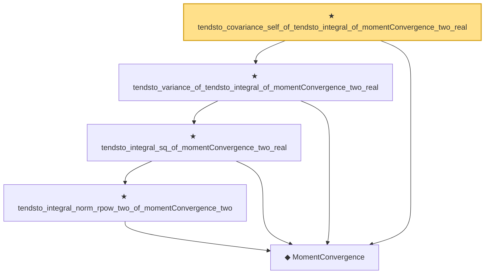

# Proof narrative — tendsto_covariance_self_of_tendsto_integral_of_momentConvergence_two_real

Root: **tendsto_covariance_self_of_tendsto_integral_of_momentConvergence_two_real** (theorem) `Statlib/StatFoundation/Convergence/AnalysisTools/IntegralConvergence.lean:400` · topic `StatFoundation`
Closure: 5 declarations across 2 files. Generated from `proof_graph.json` — no files were moved.

Reading order (foundations first, headline last):

  ◆ `MomentConvergence` — def · `Statlib/StatFoundation/Convergence/AnalysisTools/ConvergenceModes.lean:113`  _(also used by 4: momentConvergence_one_of_inLpConvergence_one, momentConvergence_one_of_inProbabilityConvergence_of_isUniformIntegrable, momentConvergence_two_of_tendsto_integral_norm_rpow_two, …)_
      ★ `tendsto_integral_norm_rpow_two_of_momentConvergence_two` — theorem · `Statlib/StatFoundation/Convergence/AnalysisTools/IntegralConvergence.lean:298`
    ★ `tendsto_integral_sq_of_momentConvergence_two_real` — theorem · `Statlib/StatFoundation/Convergence/AnalysisTools/IntegralConvergence.lean:318`
  ★ `tendsto_variance_of_tendsto_integral_of_momentConvergence_two_real` — theorem · `Statlib/StatFoundation/Convergence/AnalysisTools/IntegralConvergence.lean:339`
★ `tendsto_covariance_self_of_tendsto_integral_of_momentConvergence_two_real` — theorem · `Statlib/StatFoundation/Convergence/AnalysisTools/IntegralConvergence.lean:400` **← headline**

## Dependency diagram

