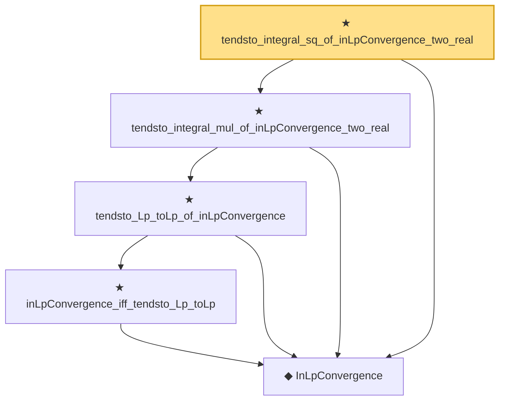

# Proof narrative — tendsto_integral_sq_of_inLpConvergence_two_real

Root: **tendsto_integral_sq_of_inLpConvergence_two_real** (theorem) `Statlib/StatFoundation/Convergence/AnalysisTools/IntegralConvergence.lean:1985` · topic `StatFoundation`
Closure: 5 declarations across 2 files. Generated from `proof_graph.json` — no files were moved.

Reading order (foundations first, headline last):

  ◆ `InLpConvergence` — def · `Statlib/StatFoundation/Convergence/AnalysisTools/ConvergenceModes.lean:77`  _(also used by 65: inLpConvergence_congr_left, inLpConvergence_congr_right, inLpConvergence_congr, …)_
      ★ `inLpConvergence_iff_tendsto_Lp_toLp` — theorem · `Statlib/StatFoundation/Convergence/AnalysisTools/ConvergenceModes.lean:1046`  _(also used by 1: inLpConvergence_of_tendsto_Lp_toLp)_
    ★ `tendsto_Lp_toLp_of_inLpConvergence` — theorem · `Statlib/StatFoundation/Convergence/AnalysisTools/ConvergenceModes.lean:1059`
  ★ `tendsto_integral_mul_of_inLpConvergence_two_real` — theorem · `Statlib/StatFoundation/Convergence/AnalysisTools/IntegralConvergence.lean:1941`  _(also used by 4: tendsto_pairwise_integral_mul_of_forall_inLpConvergence_two_real, tendsto_covariance_of_inLpConvergence_two_real, tendsto_cross_covariance_matrix_of_forall_inLpConvergence_two_real, …)_
★ `tendsto_integral_sq_of_inLpConvergence_two_real` — theorem · `Statlib/StatFoundation/Convergence/AnalysisTools/IntegralConvergence.lean:1985` **← headline**

## Dependency diagram

