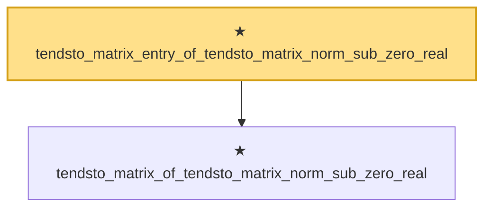

# Proof narrative — tendsto_matrix_entry_of_tendsto_matrix_norm_sub_zero_real

Root: **tendsto_matrix_entry_of_tendsto_matrix_norm_sub_zero_real** (theorem) `Statlib/StatFoundation/Convergence/AnalysisTools/IntegralConvergence.lean:805` · topic `StatFoundation`
Closure: 2 declarations across 1 files. Generated from `proof_graph.json` — no files were moved.

Reading order (foundations first, headline last):

  ★ `tendsto_matrix_of_tendsto_matrix_norm_sub_zero_real` — theorem · `Statlib/StatFoundation/Convergence/AnalysisTools/IntegralConvergence.lean:796`
★ `tendsto_matrix_entry_of_tendsto_matrix_norm_sub_zero_real` — theorem · `Statlib/StatFoundation/Convergence/AnalysisTools/IntegralConvergence.lean:805` **← headline**

## Dependency diagram

