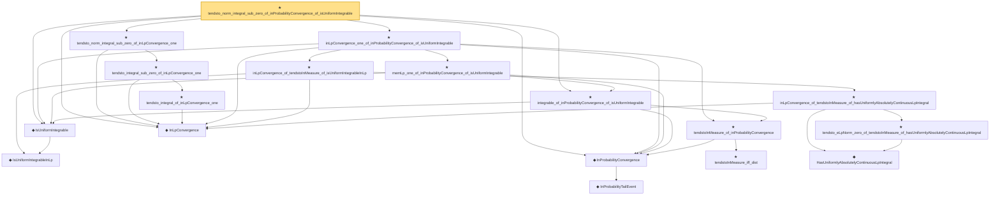

# Proof narrative — tendsto_norm_integral_sub_zero_of_inProbabilityConvergence_of_isUniformIntegrable

Root: **tendsto_norm_integral_sub_zero_of_inProbabilityConvergence_of_isUniformIntegrable** (theorem) `Statlib/StatFoundation/Convergence/AnalysisTools/IntegralConvergence.lean:84` · topic `StatFoundation`
Closure: 18 declarations across 4 files. Generated from `proof_graph.json` — no files were moved.

Reading order (foundations first, headline last):

    ◆ `IsUniformIntegrableInLp` — abbrev · `Statlib/StatFoundation/Vocabulary/UniformIntegrability.lean:53`  _(also used by 38: memLp_two_of_inProbabilityConvergence_of_isUniformIntegrableInLp_two, inLpConvergence_two_of_inProbabilityConvergence_of_isUniformIntegrableInLp_two, tendsto_integral_of_inProbabilityConvergence_of_isUniformIntegrableInLp_two, …)_
  ◆ `IsUniformIntegrable` — abbrev · `Statlib/StatFoundation/Vocabulary/UniformIntegrability.lean:59`  _(also used by 10: tendsto_integral_of_inProbabilityConvergence_of_isUniformIntegrable, tendsto_integral_continuousLinearMap_of_inProbabilityConvergence_of_isUniformIntegrable, tendsto_norm_integral_continuousLinearMap_sub_zero_of_inProbabilityConvergence_ui, …)_
    ◆ `InProbabilityTailEvent` — def · `Statlib/StatFoundation/Convergence/AnalysisTools/ConvergenceModes.lean:46`  _(also used by 10: t_test_consistent, CompleteConvergence, inProbabilityConvergence_of_tendstoInMeasure, …)_
  ◆ `InProbabilityConvergence` — def · `Statlib/StatFoundation/Convergence/AnalysisTools/ConvergenceModes.lean:61`  _(also used by 70: t_test_consistent, inProbabilityConvergence_of_tendstoInMeasure, inProbabilityConvergence_iff_tendstoInMeasure, …)_
      ★ `tendstoInMeasure_iff_dist` — theorem · `Statlib/StatFoundation/Convergence/AnalysisTools/ConvergenceModes.lean:574`  _(also used by 5: tendstoInMeasure_lipschitz, tendstoInMeasure_inv_of_ne_zero, tendstoInMeasure_const_of_rescaled_tendstoInDistribution, …)_
    ★ `tendstoInMeasure_of_inProbabilityConvergence` — theorem · `Statlib/StatFoundation/Convergence/AnalysisTools/ConvergenceModes.lean:696`  _(also used by 9: inProbabilityConvergence_iff_tendstoInMeasure, inProbabilityConvergence_subseq, inProbabilityConvergence_congr_left, …)_
  ★ `integrable_of_inProbabilityConvergence_of_isUniformIntegrable` — theorem · `Statlib/StatFoundation/Convergence/AnalysisTools/UniformIntegrability.lean:130`  _(also used by 4: tendsto_integral_of_inProbabilityConvergence_of_isUniformIntegrable, tendsto_integral_continuousLinearMap_of_inProbabilityConvergence_of_isUniformIntegrable, tendsto_norm_integral_continuousLinearMap_sub_zero_of_inProbabilityConvergence_ui, …)_
  ◆ `InLpConvergence` — def · `Statlib/StatFoundation/Convergence/AnalysisTools/ConvergenceModes.lean:77`  _(also used by 62: inLpConvergence_congr_left, inLpConvergence_congr_right, inLpConvergence_congr, …)_
        ◆ `HasUniformlyAbsolutelyContinuousLpIntegral` — abbrev · `Statlib/StatFoundation/Vocabulary/UniformIntegrability.lean:25`  _(also used by 5: tendstoInMeasure_and_hasUniformlyAbsolutelyContinuousLpIntegral_iff_inLpConvergence, hasUniformlyAbsolutelyContinuousLpIntegral_of_inLpConvergence, inProbabilityConvergence_and_uacIntegral_iff_inLpConvergence_one, …)_
        ★ `tendsto_eLpNorm_zero_of_tendstoInMeasure_of_hasUniformlyAbsolutelyContinuousLpIntegral` — theorem · `Statlib/StatFoundation/Convergence/AnalysisTools/UniformIntegrability.lean:62`
      ★ `inLpConvergence_of_tendstoInMeasure_of_hasUniformlyAbsolutelyContinuousLpIntegral` — theorem · `Statlib/StatFoundation/Convergence/AnalysisTools/UniformIntegrability.lean:76`
    ★ `inLpConvergence_of_tendstoInMeasure_of_isUniformIntegrableInLp` — theorem · `Statlib/StatFoundation/Convergence/AnalysisTools/UniformIntegrability.lean:90`  _(also used by 1: inLpConvergence_two_of_inProbabilityConvergence_of_isUniformIntegrableInLp_two)_
    ★ `memLp_one_of_inProbabilityConvergence_of_isUniformIntegrable` — theorem · `Statlib/StatFoundation/Convergence/AnalysisTools/UniformIntegrability.lean:140`
  ★ `inLpConvergence_one_of_inProbabilityConvergence_of_isUniformIntegrable` — theorem · `Statlib/StatFoundation/Convergence/AnalysisTools/UniformIntegrability.lean:150`  _(also used by 4: tendsto_integral_of_inProbabilityConvergence_of_isUniformIntegrable, tendsto_integral_continuousLinearMap_of_inProbabilityConvergence_of_isUniformIntegrable, tendsto_norm_integral_continuousLinearMap_sub_zero_of_inProbabilityConvergence_ui, …)_
      ★ `tendsto_integral_of_inLpConvergence_one` — theorem · `Statlib/StatFoundation/Convergence/AnalysisTools/IntegralConvergence.lean:23`  _(also used by 4: tendsto_integral_of_inProbabilityConvergence_of_isUniformIntegrable, tendsto_integral_continuousLinearMap_of_inLpConvergence_one, tendsto_integral_norm_of_inLpConvergence_one, …)_
    ★ `tendsto_integral_sub_zero_of_inLpConvergence_one` — theorem · `Statlib/StatFoundation/Convergence/AnalysisTools/IntegralConvergence.lean:34`
  ★ `tendsto_norm_integral_sub_zero_of_inLpConvergence_one` — theorem · `Statlib/StatFoundation/Convergence/AnalysisTools/IntegralConvergence.lean:54`  _(also used by 1: tendsto_norm_integral_continuousLinearMap_sub_zero_of_inLpConvergence_one)_
★ `tendsto_norm_integral_sub_zero_of_inProbabilityConvergence_of_isUniformIntegrable` — theorem · `Statlib/StatFoundation/Convergence/AnalysisTools/IntegralConvergence.lean:84` **← headline**

## Dependency diagram

