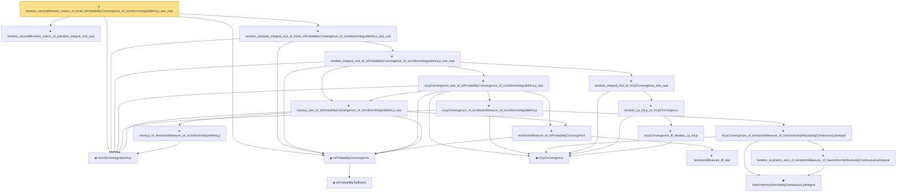

# Proof narrative — tendsto_secondMoment_matrix_of_forall_inProbabilityConvergence_of_isUniformIntegrableInLp_two_real

Root: **tendsto_secondMoment_matrix_of_forall_inProbabilityConvergence_of_isUniformIntegrableInLp_two_real** (theorem) `Statlib/StatFoundation/Convergence/AnalysisTools/IntegralConvergence.lean:2618` · topic `StatFoundation`
Closure: 20 declarations across 4 files. Generated from `proof_graph.json` — no files were moved.

Reading order (foundations first, headline last):

  ◆ `IsUniformIntegrableInLp` — abbrev · `Statlib/StatFoundation/Vocabulary/UniformIntegrability.lean:53`  _(also used by 33: tendsto_integral_of_inProbabilityConvergence_of_isUniformIntegrableInLp_two, tendsto_covariance_of_inProbabilityConvergence_of_isUniformIntegrableInLp_two_real, tendsto_pairwise_integral_mul_cross_of_forall_inProbabilityConvergence_of_isUniformIntegrableInLp_two_real, …)_
    ◆ `InProbabilityTailEvent` — def · `Statlib/StatFoundation/Convergence/AnalysisTools/ConvergenceModes.lean:46`  _(also used by 10: t_test_consistent, CompleteConvergence, inProbabilityConvergence_of_tendstoInMeasure, …)_
  ◆ `InProbabilityConvergence` — def · `Statlib/StatFoundation/Convergence/AnalysisTools/ConvergenceModes.lean:61`  _(also used by 69: t_test_consistent, inProbabilityConvergence_of_tendstoInMeasure, inProbabilityConvergence_iff_tendstoInMeasure, …)_
  ★ `tendsto_secondMoment_matrix_of_pairwise_integral_mul_real` — theorem · `Statlib/StatFoundation/Convergence/AnalysisTools/IntegralConvergence.lean:1762`  _(also used by 1: tendsto_secondMoment_matrix_of_forall_inLpConvergence_two_real)_
        ◆ `InLpConvergence` — def · `Statlib/StatFoundation/Convergence/AnalysisTools/ConvergenceModes.lean:77`  _(also used by 63: inLpConvergence_congr_left, inLpConvergence_congr_right, inLpConvergence_congr, …)_
          ★ `inLpConvergence_iff_tendsto_Lp_toLp` — theorem · `Statlib/StatFoundation/Convergence/AnalysisTools/ConvergenceModes.lean:1046`  _(also used by 1: inLpConvergence_of_tendsto_Lp_toLp)_
        ★ `tendsto_Lp_toLp_of_inLpConvergence` — theorem · `Statlib/StatFoundation/Convergence/AnalysisTools/ConvergenceModes.lean:1059`
      ★ `tendsto_integral_mul_of_inLpConvergence_two_real` — theorem · `Statlib/StatFoundation/Convergence/AnalysisTools/IntegralConvergence.lean:1941`  _(also used by 4: tendsto_integral_sq_of_inLpConvergence_two_real, tendsto_pairwise_integral_mul_of_forall_inLpConvergence_two_real, tendsto_covariance_of_inLpConvergence_two_real, …)_
        ★ `memLp_of_tendstoInMeasure_of_isUniformIntegrableInLp` — theorem · `Statlib/StatFoundation/Convergence/AnalysisTools/UniformIntegrability.lean:214`
          ★ `tendstoInMeasure_iff_dist` — theorem · `Statlib/StatFoundation/Convergence/AnalysisTools/ConvergenceModes.lean:574`  _(also used by 5: tendstoInMeasure_lipschitz, tendstoInMeasure_inv_of_ne_zero, tendstoInMeasure_const_of_rescaled_tendstoInDistribution, …)_
        ★ `tendstoInMeasure_of_inProbabilityConvergence` — theorem · `Statlib/StatFoundation/Convergence/AnalysisTools/ConvergenceModes.lean:696`  _(also used by 9: inProbabilityConvergence_iff_tendstoInMeasure, inProbabilityConvergence_subseq, inProbabilityConvergence_congr_left, …)_
      ★ `memLp_two_of_inProbabilityConvergence_of_isUniformIntegrableInLp_two` — theorem · `Statlib/StatFoundation/Convergence/AnalysisTools/IntegralConvergence.lean:2458`  _(also used by 13: tendsto_integral_of_inProbabilityConvergence_of_isUniformIntegrableInLp_two, tendsto_covariance_of_inProbabilityConvergence_of_isUniformIntegrableInLp_two_real, tendsto_secondMoment_matrix_toEuclideanCLM_of_forall_inProbabilityConvergence_of_isUniformIntegrableInLp_two_real, …)_
            ◆ `HasUniformlyAbsolutelyContinuousLpIntegral` — abbrev · `Statlib/StatFoundation/Vocabulary/UniformIntegrability.lean:25`  _(also used by 5: tendstoInMeasure_and_hasUniformlyAbsolutelyContinuousLpIntegral_iff_inLpConvergence, hasUniformlyAbsolutelyContinuousLpIntegral_of_inLpConvergence, inProbabilityConvergence_and_uacIntegral_iff_inLpConvergence_one, …)_
            ★ `tendsto_eLpNorm_zero_of_tendstoInMeasure_of_hasUniformlyAbsolutelyContinuousLpIntegral` — theorem · `Statlib/StatFoundation/Convergence/AnalysisTools/UniformIntegrability.lean:62`
          ★ `inLpConvergence_of_tendstoInMeasure_of_hasUniformlyAbsolutelyContinuousLpIntegral` — theorem · `Statlib/StatFoundation/Convergence/AnalysisTools/UniformIntegrability.lean:76`
        ★ `inLpConvergence_of_tendstoInMeasure_of_isUniformIntegrableInLp` — theorem · `Statlib/StatFoundation/Convergence/AnalysisTools/UniformIntegrability.lean:90`  _(also used by 1: inLpConvergence_one_of_inProbabilityConvergence_of_isUniformIntegrable)_
      ★ `inLpConvergence_two_of_inProbabilityConvergence_of_isUniformIntegrableInLp_two` — theorem · `Statlib/StatFoundation/Convergence/AnalysisTools/IntegralConvergence.lean:2469`  _(also used by 13: tendsto_integral_of_inProbabilityConvergence_of_isUniformIntegrableInLp_two, tendsto_covariance_of_inProbabilityConvergence_of_isUniformIntegrableInLp_two_real, tendsto_secondMoment_matrix_toEuclideanCLM_of_forall_inProbabilityConvergence_of_isUniformIntegrableInLp_two_real, …)_
    ★ `tendsto_integral_mul_of_inProbabilityConvergence_of_isUniformIntegrableInLp_two_real` — theorem · `Statlib/StatFoundation/Convergence/AnalysisTools/IntegralConvergence.lean:2497`  _(also used by 1: tendsto_pairwise_integral_mul_cross_of_forall_inProbabilityConvergence_of_isUniformIntegrableInLp_two_real)_
  ★ `tendsto_pairwise_integral_mul_of_forall_inProbabilityConvergence_of_isUniformIntegrableInLp_two_real` — theorem · `Statlib/StatFoundation/Convergence/AnalysisTools/IntegralConvergence.lean:2533`
★ `tendsto_secondMoment_matrix_of_forall_inProbabilityConvergence_of_isUniformIntegrableInLp_two_real` — theorem · `Statlib/StatFoundation/Convergence/AnalysisTools/IntegralConvergence.lean:2618` **← headline**

## Dependency diagram

