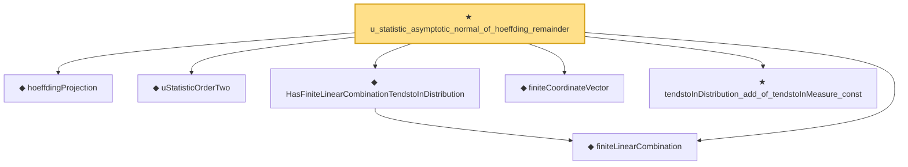

# Proof narrative — u_statistic_asymptotic_normal_of_hoeffding_remainder

Root: **u_statistic_asymptotic_normal_of_hoeffding_remainder** (theorem) `Statlib/StatFoundation/Statistics/Estimation/UStatistic.lean:32` · topic `StatFoundation`
Closure: 7 declarations across 4 files. Generated from `proof_graph.json` — no files were moved.

Reading order (foundations first, headline last):

  ◆ `hoeffdingProjection` — noncomputable def · `Statlib/StatFoundation/Statistics/Estimation/Vocabulary.lean:145`
  ◆ `uStatisticOrderTwo` — noncomputable def · `Statlib/StatFoundation/Statistics/Estimation/Vocabulary.lean:133`
  ◆ `finiteLinearCombination` — noncomputable abbrev · `Statlib/StatFoundation/Vocabulary/FiniteCoordinate.lean:29`  _(also used by 17: tendstoInDistribution_debiasedLasso_scaledCenteredFiniteCoordinate_of_linearScore_and_l1_rowApprox_real, hasFiniteLinearCombinationIsBigOInProbability_of_coordinatewise_real, hasFiniteLinearCombinationIsLittleOInProbability_of_coordinatewise_real, …)_
  ◆ `HasFiniteLinearCombinationTendstoInDistribution` — abbrev · `Statlib/StatFoundation/Vocabulary/FiniteCoordinate.lean:43`  _(also used by 23: tendstoInDistribution_debiasedLasso_scaledCenteredFiniteCoordinate_of_linearScore_and_l1_rowApprox_real, tendstoInDistribution_studentizedDebiasedLasso_coordinate_of_linearScore_l1_rowApprox_and_se_real, tendstoInDistribution_debiasedLasso_scaledCenteredFiniteCoordinate_of_scoreVector_and_l1_rowApprox_real, …)_
  ◆ `finiteCoordinateVector` — noncomputable abbrev · `Statlib/StatFoundation/Vocabulary/FiniteCoordinate.lean:25`  _(also used by 21: tendstoInDistribution_debiasedLasso_scaledCenteredFiniteCoordinate_of_linearScore_and_l1_rowApprox_real, tendstoInDistribution_debiasedLasso_scaledCenteredFiniteCoordinate_of_scoreVector_and_l1_rowApprox_real, tendstoInDistribution_studentizedDebiasedLasso_coordinate_of_scoreVector_l1_rowApprox_and_se_real, …)_
  ★ `tendstoInDistribution_add_of_tendstoInMeasure_const` — theorem · `Statlib/StatFoundation/Convergence/AnalysisTools/ConvergenceModes.lean:429`
★ `u_statistic_asymptotic_normal_of_hoeffding_remainder` — theorem · `Statlib/StatFoundation/Statistics/Estimation/UStatistic.lean:32` **← headline**

## Dependency diagram

