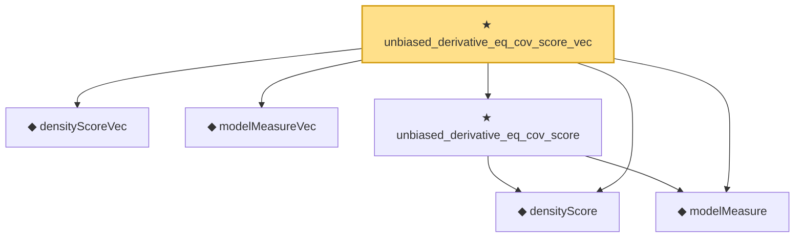

# Proof narrative — unbiased_derivative_eq_cov_score_vec

Root: **unbiased_derivative_eq_cov_score_vec** (theorem) `Statlib/StatFoundation/Statistics/Estimation/MultiParameter.lean:408` · topic `StatFoundation`
Closure: 6 declarations across 3 files. Generated from `proof_graph.json` — no files were moved.

Reading order (foundations first, headline last):

  ◆ `densityScoreVec` — noncomputable def · `Statlib/StatFoundation/Statistics/Estimation/Vocabulary.lean:161`  _(also used by 7: fisherInformationMatrix_posSemidef, fisherInfoMatrix_quadForm, score_mean_zero_vec, …)_
  ◆ `modelMeasureVec` — noncomputable def · `Statlib/StatFoundation/Statistics/Estimation/Vocabulary.lean:191`  _(also used by 3: matrix_cram, mle_asymptotic_normal_vec_cov, mle_asymptotically_efficient)_
  ◆ `densityScore` — noncomputable def · `Statlib/StatFoundation/Statistics/Estimation/Vocabulary.lean:64`  _(also used by 7: score_mean_zero_of_density_regular, cramer_rao_lower_bound, fisher_identity_of_second_derivative, …)_
  ◆ `modelMeasure` — noncomputable def · `Statlib/StatFoundation/Statistics/Estimation/Vocabulary.lean:87`  _(also used by 1: cramer_rao_lower_bound)_
  ★ `unbiased_derivative_eq_cov_score` — theorem · `Statlib/StatFoundation/Statistics/Estimation/CramerRao.lean:114`  _(also used by 1: cramer_rao_lower_bound)_
★ `unbiased_derivative_eq_cov_score_vec` — theorem · `Statlib/StatFoundation/Statistics/Estimation/MultiParameter.lean:408` **← headline**

## Dependency diagram

